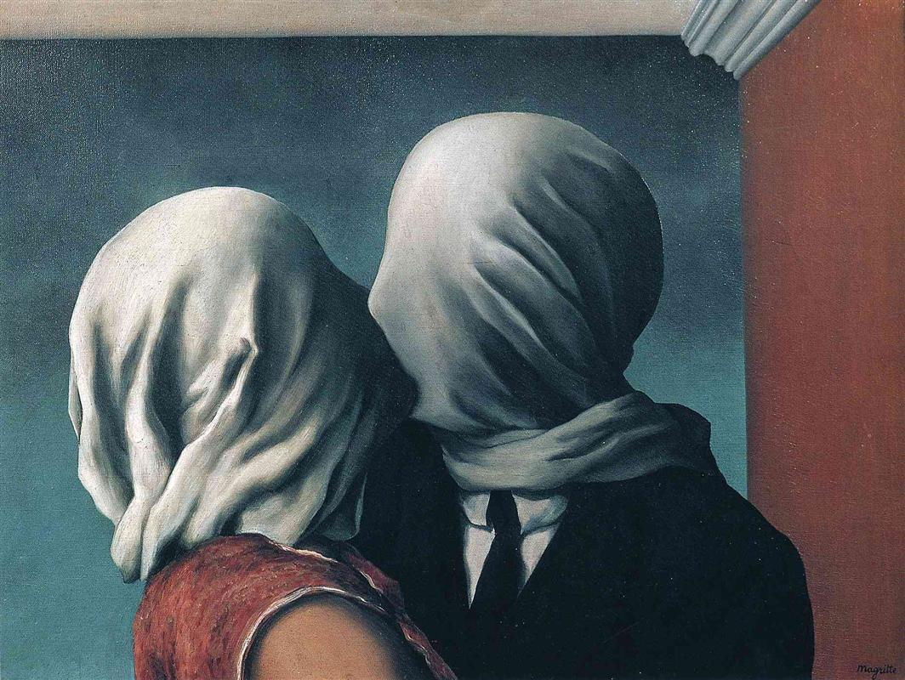

## 基本信息

- 作者：马格利特 René Magritte (*not from wiki*；wiki 尚未立人物页)
- 创作年代：1928
- 材质：布面油画 (*not from wiki*)
- 尺寸：(*not from wiki*) 约 54 × 73 cm
- 现存地：(*not from wiki*) 纽约现代艺术博物馆 MoMA

## 画面与技法

092 仅以图像形式出现（无独立讨论）。作为早期 [[超现实主义 Surrealism]] **梦境派**代表作列入。

(*not from wiki*) 画面：一对男女在亲吻，但二人的脸都被**白布完全包裹**——亲吻**穿不过布料**。马格利特用最朴素的写实技法表达**视觉与触觉的可达性悖论**——典型的"梦境派/偏执狂批评派"超现实主义路径（区别于恩斯特的拼贴/[[自动写作 Automatic Writing]] 路径）。

## 历史背景 (*not from wiki*)

1928 年马格利特住在巴黎郊区，与 [[布勒东 André Breton]] 圈子接触；同年他画了多个版本的《恋人》。一种流传甚广（已被本人否认）的解读，把白布与马格利特母亲 1912 年自溺被发现时**脸被睡裙裹住**的童年记忆关联。

## 图片清单

| 编号 | 出自 | 描述 |
|---|---|---|
| 01 | [[092｜超现实主义为什么会诞生？]] | 全图——超现实主义梦境派样本 |

## 出现在

- [[092｜超现实主义为什么会诞生？]]
