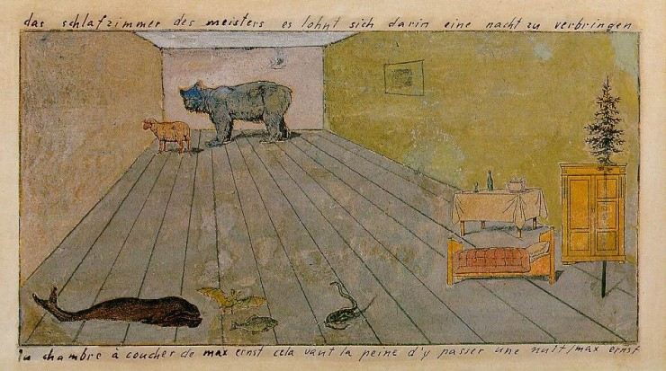

## 基本信息

- 作者：[[恩斯特 Max Ernst]]
- 创作年代：1920
- 材质：水粉、铅笔在印刷品上的拼贴 / 改造 (*not from wiki*)
- 现存地：私人收藏 (*not from wiki*)

## 画面与技法

恩斯特早期（达达 → 早期超现实主义过渡）代表作。**寝室里出现的几只动物**——本课明确把它当作 [[洛特雷阿蒙 Comte de Lautréamont]] 式错位搭配的范例：动物与卧室是完全不该并置的元素，"通过模仿'缝纫机、雨伞和解剖台'这样错位的词语搭配，来营造诗意的努力"。

把单只动物（如某只羊、某只鱼）解读为某个固定象征，**没有根据**——这是恩斯特反对精神分析式解读时反复强调的。

## 图片清单

| 编号 | 出自 | 描述 |
|---|---|---|
| 01 | [[093｜契里柯与恩斯特：如何用绘画表现超现实主义？]] | 一个透视化的卧室空间内散布数只动物（如鱼、绵羊、熊、蛇等）—— 既无序又像被定格 |

## 出现在

- [[093｜契里柯与恩斯特：如何用绘画表现超现实主义？]] — 寝室里的几只动物：错位搭配诗意的经典示例
