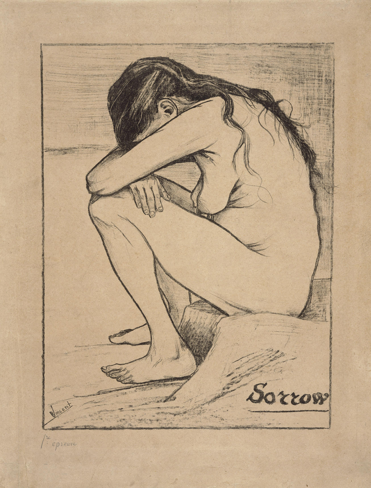

## 基本信息

- 作者：[[凡·高 Vincent van Gogh]]
- 创作年代：1882
- 材质：纸面石版画 / 铅笔素描 (*not from wiki*)
- 尺寸：—
- 现存地：—
- 模特：[[西恩·霍尼克 Sien Hoornik]]

## 画面与技法

裸体怀孕女性蜷坐、双手抱头的素描/石版画。模特是凡·高当时在海牙同居的妓女 [[西恩·霍尼克 Sien Hoornik]]——同居时她带 5 个孩子且怀孕 5 个月。057 把这一同居事件定为凡·高"第三次为女人作大死"，海牙绘画圈因此向他关上大门、叔叔柯尔订的 12 幅插画也退货。

## 历史背景 (*not from wiki*)

凡·高自评《悲伤》是当时所作最好的素描之一。画作背景配铭文"Comment se fait-il qu'il y ait sur la terre une femme seule – délaissée"（"为什么世上会有一个孤单被遗弃的女人"）——他视之为对底层女性命运的同情陈述。

## 图片清单

| 编号 | 出自 | 描述 |
|---|---|---|
| 01 | [[057｜凡·高1：为什么说他"性格决定命运"？]] | 凡·高 1882 年《悲伤》，模特为西恩 |

## 出现在

- [[057｜凡·高1：为什么说他"性格决定命运"？]]
