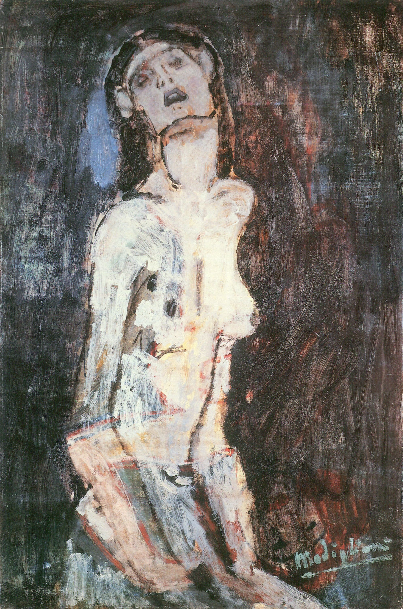

## 基本信息

- 作者：[[莫迪里阿尼 Amedeo Modigliani]]
- 创作年代：1908
- 材质：布面油画 (*not from wiki*)
- 尺寸：(*未知*)
- 现存地：(*未知*)

## 画面与技法

后仰的头、迷醉的表情——顾衡 078 明确指出：**明显有着 [[爱德华·蒙克 Edvard Munch]] 《[[圣母像 Madonna (Munch)]]》的影子**。早期莫迪里阿尼借鉴蒙克的"程式化抑郁感"，但已开始把情感**弥散在整个画面**中而非靠表情符号承载。

## 历史背景 (*not from wiki*)

莫迪里阿尼早期罕见以"悲痛"为题命名的作品；这种题名方式与蒙克"圣母 / 焦虑 / 嫉妒"母题命名法直接呼应。

## 图片清单

| 编号 | 出自 | 描述 |
|---|---|---|
| 01 | [[078｜莫迪里阿尼：画中女子为什么让人一眼难忘？]] | 后仰头部、迷醉表情 |

## 出现在

- [[078｜莫迪里阿尼：画中女子为什么让人一眼难忘？]]
