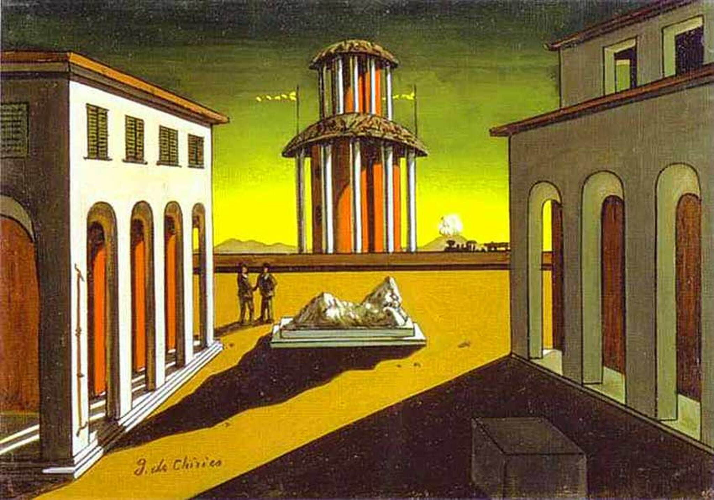

## 基本信息

- 作者：[[契里柯 Giorgio de Chirico]]
- 创作年代：1913（契里柯一生反复以"意大利广场"为题创作多个版本） (*not from wiki*)
- 材质：布面油画 (*not from wiki*)
- 现存地：多个版本分散于公私机构 (*not from wiki*)

## 画面与技法

[[形而上画派 Metaphysical Painting]] 的招牌图式："意大利广场"是契里柯反复回归的母题，本课所示为 1913 年版（在 1914《[[一条街道的忧郁与神秘 (契里柯) Mystery and Melancholy of a Street]]》之前）。

构成要素：

- **空旷的拱廊广场**
- 中心或一侧的**纪念碑/雕像**
- **长长的投影**——光源位置营造傍晚或某种"非时间"的状态
- 偶尔点缀小小的人影或火车烟雾——拉远了的"现代性"残片

契里柯把它作为"用绘画把尼采哲学幻相画出来"的反复试炼。

## 图片清单

| 编号 | 出自 | 描述 |
|---|---|---|
| 01 | [[093｜契里柯与恩斯特：如何用绘画表现超现实主义？]] | 黄色调广场，中央拱廊建筑，前景大块投影，远处可见小小人物剪影 |

## 出现在

- [[093｜契里柯与恩斯特：如何用绘画表现超现实主义？]] — 形而上画派的"意大利广场"母题
