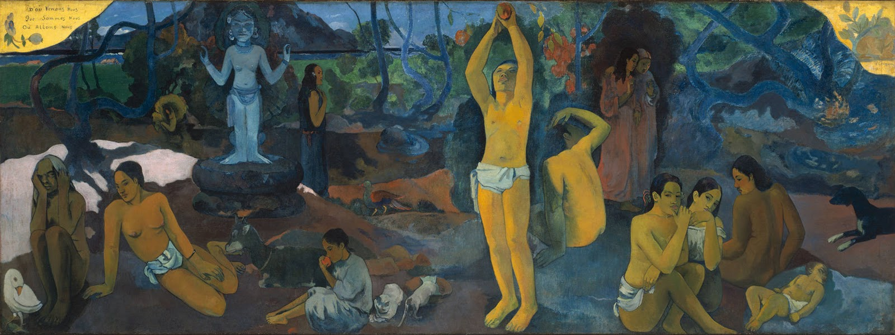

## 基本信息

- 作者: [[高更 Paul Gauguin]]
- 创作年代: 1897–1898
- 材质: 布面油画 (*not from wiki*)
- 尺寸: 139.1 × 374.6 cm (*not from wiki*)
- 现存地: 波士顿美术博物馆 (Museum of Fine Arts, Boston) (*not from wiki*)

## 画面与技法

- 高更最大的一幅画，也是他自己评价最高的一幅。
- 高更自述（顾衡 056 引）：
  > 我再也画不出比这更好、更有价值的画了……我的眼睛看得如此真切，以至于一切轻率仓促的痕迹荡然无存，它们看见的，就是生活本身。
- 顾衡随后冷评："**但是，如果这段话是高更的肺腑之言的话，这很难说不是一个绝妙的反讽。**"
- 横长卷构图，从右至左展开"婴儿—成年—老年"的生命三段；标题三问以法语题写在画面左上角。
- [[综合主义 Synthetism]] 在塔希提阶段的集大成——形体高度简化、平涂、主观色彩、装饰性强烈。

## 历史背景 (*not from wiki*)

1897 高更经济与健康双重恶化，画完这幅大画后曾试图自杀但未遂；之后又在梅毒、贫穷、不甘中挣扎了七年，1903 年去世。

## 图片清单

| 编号 | 出自 | 描述 |
|---|---|---|
| 01 | [[056｜高更2：象征主义还能走多远？]] | 全图 — 横卷三段生命寓言 |

## 出现在

- [[056｜高更2：象征主义还能走多远？]]
