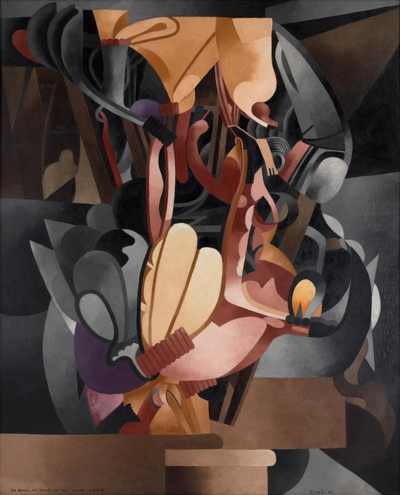

## 基本信息

- 作者：[[毕卡比亚 Francis Picabia]]
- 创作年代：1914
- 材质：布面油画 (*not from wiki*)
- 尺寸：约 250 × 199 cm (*not from wiki*)
- 现存地：纽约现代艺术博物馆 MoMA (*not from wiki*)

## 画面与技法

[[毕卡比亚 Francis Picabia]] 1914 年作品，承接前一年的《[[UDNIE 年轻的美国女孩 Udnie, Young American Girl]]》。

**与杜尚《[[从处女到已婚妇女的过程 The Passage from Virgin to Bride]]》(1912) 同样**：都是**机器装置与女性器官的并置**——这是杜尚 / 毕卡比亚后续 "**用机器表现女人 / 性**" 的母题源头。

**关键区别**：
- 杜尚还在坚持 [[分析立体主义 Analytical Cubism]] 的褐色单色调
- 毕卡比亚已经"**花花绿绿**"——因为受了 [[德劳内 Robert Delaunay]] [[同时性绘画 Simultaneous Paintings]] 色彩理论的熏陶

## 历史背景

(*not from wiki*) 1914 年一战爆发；毕卡比亚很快应征入伍。

## 图片清单

| 编号 | 出自 | 描述 |
|---|---|---|
| 01 | [[091｜毕卡比亚：如何用绘画表现达达主义？]] | 整体图 — 彩色机器与女性器官并置 |

## 出现在

- [[091｜毕卡比亚：如何用绘画表现达达主义？]]
