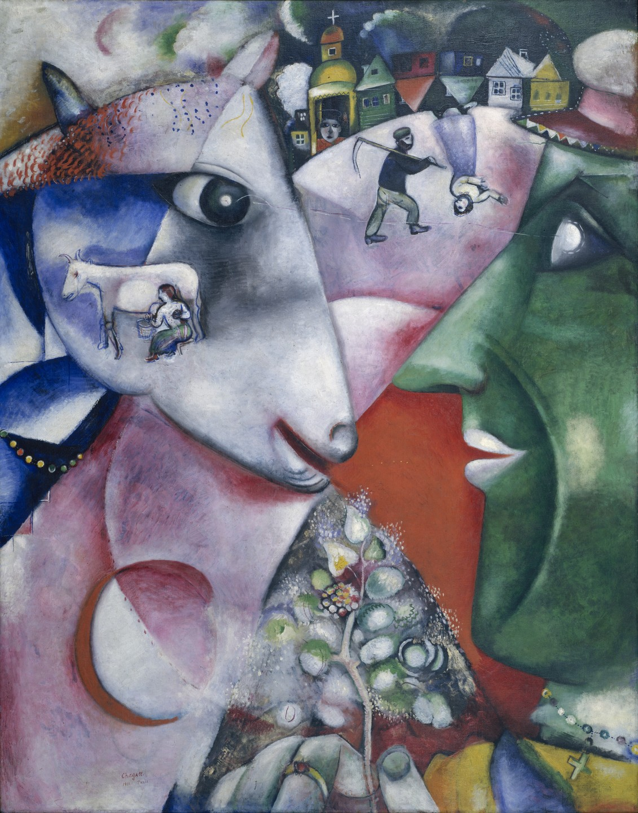

## 基本信息

- 作者：[[夏加尔 Marc Chagall]]
- 创作年代：1911
- 材质：布面油画 (*not from wiki*)
- 尺寸：约 192.1 × 151.4 cm (*not from wiki*)
- 现存地：纽约现代艺术博物馆 (MoMA) (*not from wiki*)

## 画面与技法

夏加尔的**成名作**。同时受 [[立体主义 Cubism]] 与 [[野兽派 Fauvism]] 影响——**规则的几何图形 + 鲜艳的颜色，形成奇怪的组合**。

但顾衡指出：这幅画最大的特点不在画派，而在于"**夏加尔将他所熟悉的俄罗斯传统农村生活以一种极为现代的手法表现出来**"。

画面读解（顾衡 077）：

- **前景**：一头年轻的母牛**亲切地对画家对视**
- **画家本人**被画成**鲜艳的绿色**，**手里拿着一棵开满了花的树**
- **牛眼下方**有一个**挤奶的场景**
- **背景**：一个背着锄头的农夫走在**红色的小路**上
- "**一切都是那么的梦幻**"

## 历史背景 (*not from wiki*)

1910 年夏加尔受彼得堡一位议员资助赴巴黎深造。1911 年在巴黎完成此作；让他一举出名。来自白俄罗斯**维切布斯克** (Vitebsk) 的乡村记忆——农舍、母牛、犹太村庄——是夏加尔此后**终身重复的母题**。

## 图片清单

| 编号 | 出自 | 描述 |
|---|---|---|
| 01 | [[077｜夏加尔：俄国人在巴黎]] | 成名作；绿脸画家与母牛对视、开花的树 |

## 出现在

- [[077｜夏加尔：俄国人在巴黎]] —— 成名作；立体主义几何 + 野兽派色彩 + 俄国乡愁
