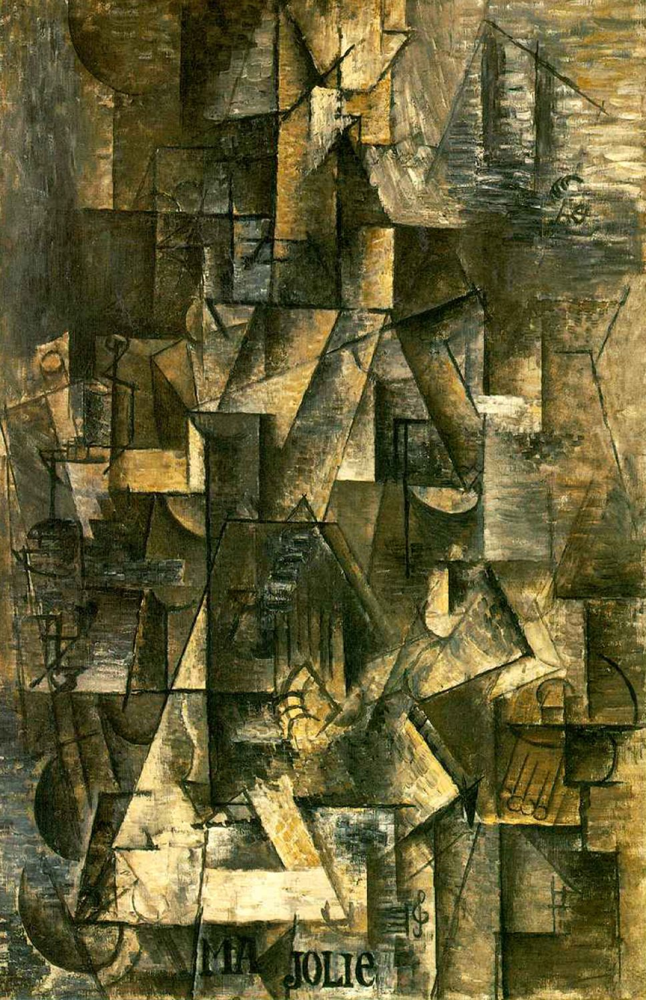

## 基本信息

- 作者：[[毕加索 Pablo Picasso]]
- 创作年代：1911–1912 (顾衡课文给出 1912)
- 材质：布面油画 (*not from wiki*)
- 尺寸：100 × 65.4 cm (*not from wiki*)
- 现存地：纽约现代艺术博物馆 MoMA (*not from wiki*)

## 画面与技法

[[分析立体主义 Analytical Cubism]] 最高抽象度作品之一——

- 顾衡（066）："这个把镜子打得更碎的办法，画得是什么我是完全看不出来了。"——若没有画框下方的字母 / 标签提示，观众几乎无法辨识画的是"女吉他手"。
- 画名 "Ma Jolie"（我的美人）来自当时巴黎流行歌曲，毕加索把它当作密码题写在画上——一般认为是写给新情人 [[伊娃 Eva Gouel]] 的隐性情书 (*not from wiki*)。
- 与同年《[[钢琴和手风琴家 The Piano Accordionist]]》、《[[有朗姆酒瓶的静物 Still Life with Bottle of Rum]]》同属"把镜子打得更碎"的极限实验——形体几乎完全溶解，**保留字母 / 标题作为唯一锚点**，标志分析立体主义的临界状态。

## 历史背景 (*not from wiki*)

- 1912 年正是毕加索从 [[费尔南德 Fernande Olivier]] 转向 [[伊娃 Eva Gouel]] 的过渡年。
- 同年 [[毕加索 Pablo Picasso]] 与 [[勃拉克 Georges Braque]] 都意识到分析立体主义已走入死胡同；不久之后他们引入拼贴 (collage) 与字母印刷碎片，开创 [[综合立体主义 Synthetic Cubism]]。
- 本作可视作分析立体主义的"末班车"——抽象到极致，正好暗示下一阶段需要外力（实物拼贴）补救。

## 图片清单

| 编号 | 出自 | 描述 |
|---|---|---|
| 01 | [[066｜毕加索3：什么是分析立体主义？]] | 全图——分析立体主义抽象度最大化的极限案例 |

## 出现在

- [[066｜毕加索3：什么是分析立体主义？]] —— [[分析立体主义 Analytical Cubism]] 抽象度极限、向 [[综合立体主义 Synthetic Cubism]] 过渡前夕
