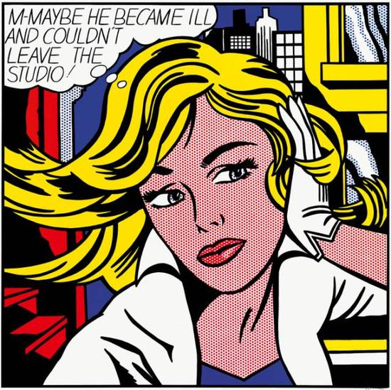

## 基本信息

- 作者：[[罗伊·利希滕斯坦 Roy Lichtenstein]]
- 创作年代：1965
- 材质：（*not from wiki*）马格纳颜料于画布
- 尺寸：（*not from wiki*）152 × 152 cm
- 现存地：（*not from wiki*）科隆路德维希博物馆 Museum Ludwig, Cologne

## 画面与技法

漫画风格金发女子半身像，配头顶对话气泡：

> **M-MAYBE HE BECAME ILL AND COULDN'T LEAVE THE STUDIO!**

利希滕斯坦把"被放鸽子的女性内心独白"——浪漫连环画里最日常的桥段——放大入画。Ben-Day 网点的肤色 / 头发 / 背景，标志性粗描边和原色——和 [[在车内 (利希滕斯坦) In the Car]] 同一手法谱系。

## 历史背景 (*not from wiki*)

- 利希滕斯坦的女性独白系列代表作之一；这一系列把女性的"被动等待 / 焦虑 / 哭泣"作为漫画格符号，被后来的女性主义批评同时认为是揭露和巩固——褒贬都有。

## 图片清单

| 编号 | 出自 | 描述 |
|---|---|---|
| 01 | [[098｜波普艺术：流行文化如何成为艺术？]] | 作品全图 |

## 出现在

- [[098｜波普艺术：流行文化如何成为艺术？]]
