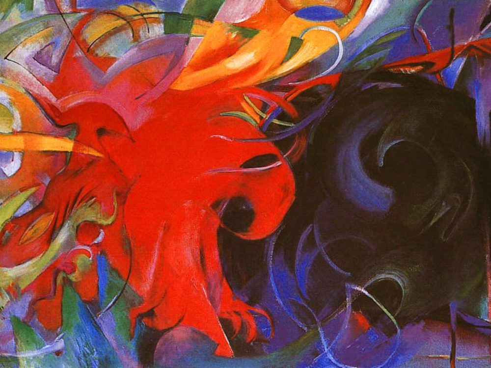

## 基本信息

- 作者：[[马尔克 Franz Marc]]
- 创作年代：1914
- 材质：油画 (*not from wiki*)
- 尺寸：91 × 131.5 cm (*not from wiki*)
- 现存地：慕尼黑·州立现代艺术馆 (Pinakothek der Moderne, München) (*not from wiki*)

## 画面与技法

[[马尔克 Franz Marc]] 1914 年完成的作品，被本讲举为 [[青骑士 Der Blaue Reiter]] 慕尼黑核心成员中"对 [[康定斯基 Wassily Kandinsky]] 跟得最紧"的证据——画面已达到**完全的抽象**。一团红、一团黑两组形体相互冲撞，可读为战争之兆。马尔克 1916 年阵亡于凡尔登战役，《战争中的形》成为他抽象转向的终点。

## 历史背景

(*not from wiki*) 创作于一战爆发前夕；马尔克作为青骑士核心成员之一，从蓝马时期的色彩象征主义快速向纯抽象推进。该作通常被视为他生前最后阶段的代表作。

## 图片清单

| 编号 | 出自 | 描述 |
|---|---|---|
| 01 | [[085｜克利：他为什么模仿小孩子画画？]] | 红黑两团抽象形体的对撞 |

## 出现在

- [[085｜克利：他为什么模仿小孩子画画？]]
