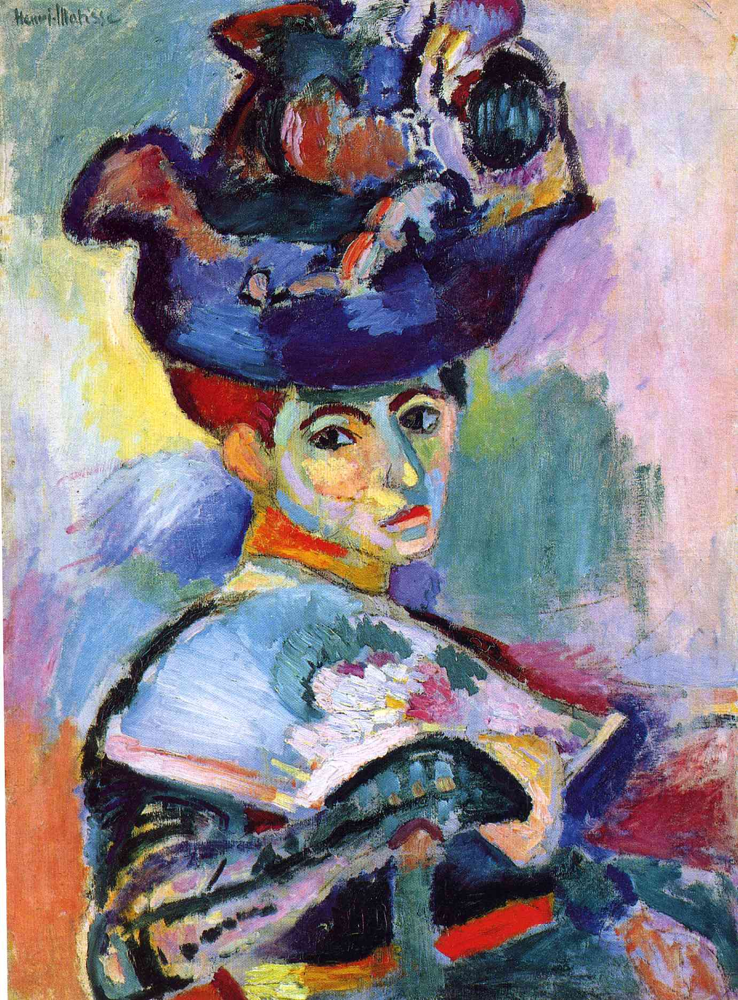

## 基本信息

- 作者：[[马蒂斯 Henri Matisse]]
- 创作年代：1905
- 材质：布面油画 (*not from wiki*)
- 尺寸：约 80.6 × 59.7 cm (*not from wiki*)
- 现存地：旧金山现代艺术博物馆 (SFMOMA) (*not from wiki*)

## 画面与技法

马蒂斯妻子 Amélie 的肖像，模特戴着夸张的羽饰宽边帽。本画作为 1905 年秋季沙龙 (Salon d'Automne) 上 [[野兽派 Fauvism]] 首次集体亮相的标志性作品之一，正是因为它和同展厅里马尔凯、卢奥、德朗、弗拉芒克等人的作品色彩"过于狂放"，批评家沃克塞尔 (Louis Vauxcelles) 把屋子中央那座新古典风格的儿童雕像戏称为"被野兽包围的多纳泰罗" (Donatello parmi les fauves)——"野兽派"由此得名 (*not from wiki*)。

技法上：

- **彻底脱离新印象主义点彩**：[[马蒂斯 Henri Matisse]] 已抛弃 [[点彩 Pointillism]]，转向大笔触、平涂式色域；
- **主观色彩**：脸部、衣物、帽子、背景一律使用与自然观察脱钩的、互补色冲撞的纯色——绿、橙、红、紫；
- **保留 [[塞尚 Paul Cézanne]] 的笔触结构**：与 [[高更 Paul Gauguin]] 的勾边平涂 ([[综合主义 Synthetism]]) 不同，马蒂斯保留并强调可见笔触，将其视为构图骨架。

## 历史背景 (*not from wiki*)

- 1905 年夏 [[马蒂斯 Henri Matisse]] 与 [[德朗 André Derain]] 在法国南部 Collioure 度夏，受蒙弗雷德展示的 [[高更 Paul Gauguin]] 大量作品冲击，回到巴黎后于秋季沙龙展出本作。
- 出展时引发轰动与丑闻；最终被 [[斯泰因兄妹 Leo & Gertrude Stein]] 买下 (500 法郎)，成为他们在巴黎花街 27 号沙龙的核心藏品，把马蒂斯推入欧美前卫艺术圈视野。

## 图片清单

| 编号 | 出自 | 描述 |
|---|---|---|
| 01 | [[061｜马蒂斯2：为什么说野兽派不"野兽"？]] | 整幅画面 |

## 出现在

- [[061｜马蒂斯2：为什么说野兽派不"野兽"？]] —— 作为 1905 [[野兽派 Fauvism]] 诞生的标志性作品引入
