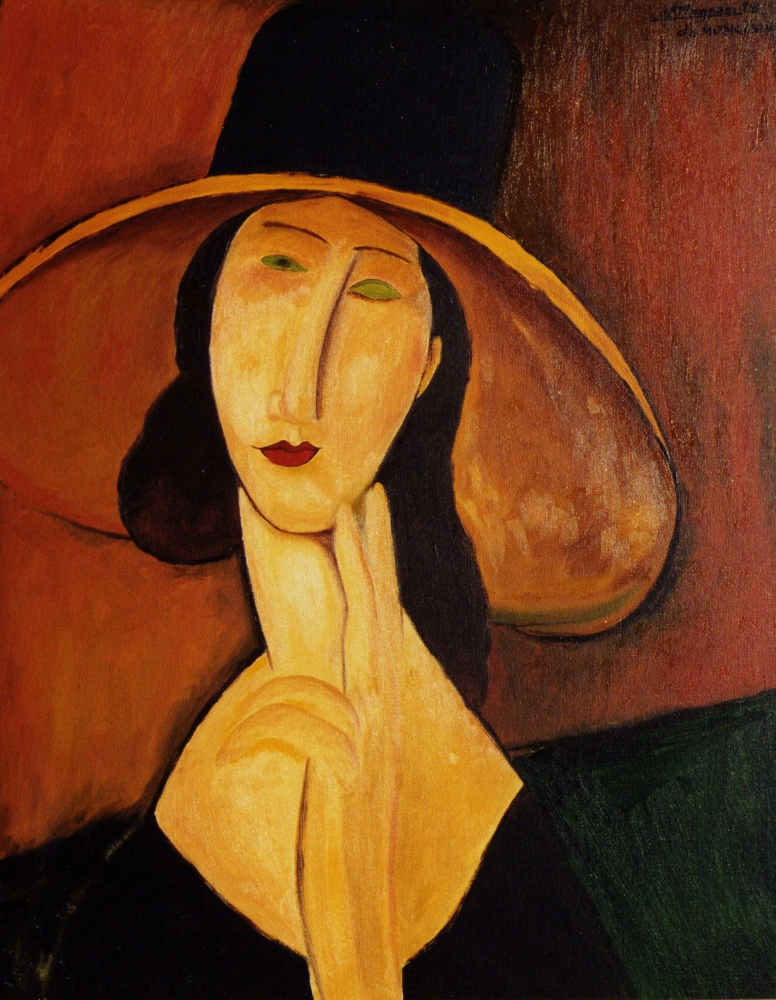

## 基本信息

- 作者：[[莫迪里阿尼 Amedeo Modigliani]]
- 创作年代：1918
- 材质：布面油画 (*not from wiki*)
- 尺寸：(*未知*)
- 现存地：私人收藏 (*not from wiki*)

## 画面与技法

[[莫迪里阿尼 Amedeo Modigliani]] 1918 年为 [[珍妮·赫比特娜 Jeanne Hébuterne]] 所作的最著名的一幅大帽肖像。深色宽帽 + 长颈 + 椭圆形脸 + 灰矇空白眼——典型的莫迪里阿尼成熟期程式。

## 历史背景 (*not from wiki*)

1918 年莫迪里阿尼为避战乱与珍妮一同前往法国南部尼斯，期间生下女儿；这批南方时期的肖像色调更柔和、笔触更稳定。

## 图片清单

| 编号 | 出自 | 描述 |
|---|---|---|
| 01 | [[078｜莫迪里阿尼：画中女子为什么让人一眼难忘？]] | 大帽珍妮半身 |

## 出现在

- [[078｜莫迪里阿尼：画中女子为什么让人一眼难忘？]]
