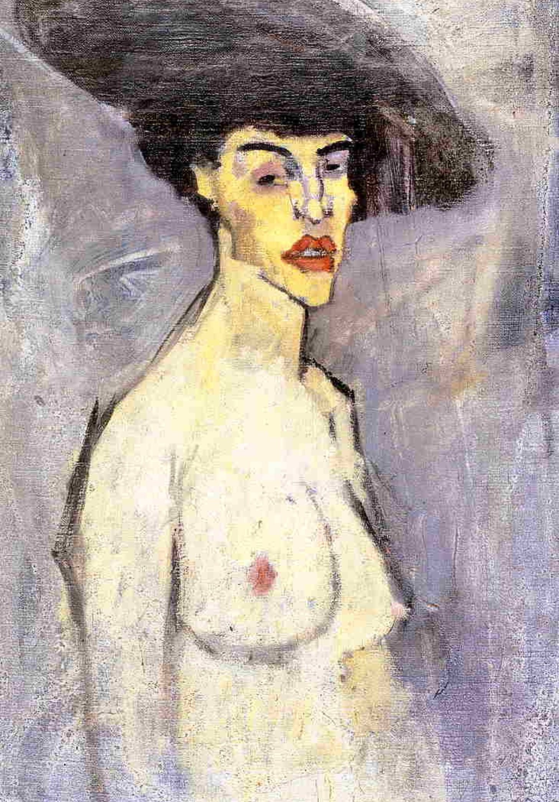

## 基本信息

- 作者：[[莫迪里阿尼 Amedeo Modigliani]]
- 创作年代：1907–1908
- 材质：布面油画 (*not from wiki*)
- 尺寸：(*未知*)
- 现存地：私人收藏 (*not from wiki*)

## 画面与技法

[[莫迪里阿尼 Amedeo Modigliani]] 早期裸女作品。色彩**晦暗而平淡**——顾衡 078 指出这显示 [[爱德华·蒙克 Edvard Munch]] 对他的影响。莫迪里阿尼此时刚到巴黎（1906），并未立即接受 [[野兽派 Fauvism]] 的强烈色彩，反而保留了北方表现主义式的低饱和度。

## 历史背景 (*not from wiki*)

属莫迪里阿尼"探索期"作品——抵巴黎后两年内尝试不同风格，尚未确立标志性的拉长形象。

## 图片清单

| 编号 | 出自 | 描述 |
|---|---|---|
| 01 | [[078｜莫迪里阿尼：画中女子为什么让人一眼难忘？]] | 戴帽裸女半身像 |

## 出现在

- [[078｜莫迪里阿尼：画中女子为什么让人一眼难忘？]]
