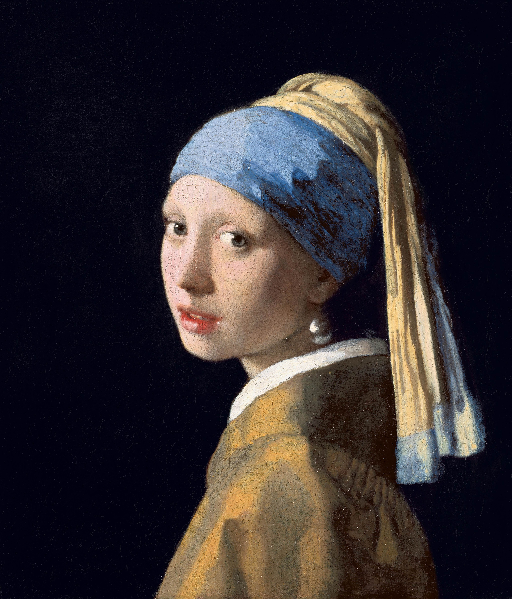

## 基本信息

- 作者：[[维米尔 Vermeer]]
- 创作年代：约 1665
- 材质：布面油画 (*not from wiki*)
- 尺寸：44.5 × 39 cm (*not from wiki*)
- 现存地：海牙莫瑞泰斯皇家美术馆 (Mauritshuis, The Hague) (*not from wiki*)

## 画面与技法

**深色背景** + **黄蓝色头巾**少女**半侧身回望**——双唇微启、左耳一颗硕大泪滴形珍珠**反射高光**。

**顾衡 037 在本课的角色**：

- 顾衡用其**作为标识维米尔身份的引子**——"维米尔，就是画《戴珍珠耳环的少女》的那个画家"
- 真正展开论述的是 [[代尔夫特一景 View of Delft]]，但本作的**惊人写实程度**——尤其珍珠的高光、皮肤的过渡——是顾衡论证维米尔**使用 [[小孔成像法 Camera Obscura]]**的潜在证据之一

**形式上**：

- **极简构图**——没有道具，只有衣装与头巾
- **光线**：左上方斜入，**唇齿微张处的高光、左眼皮的过渡、珍珠的双重反光**都精确到接近照片
- 17 世纪 _tronie_（无名肖像 / 习作头像）类型，**不是订单画**（*not from wiki*）

## 历史背景

(*not from wiki*) 长期默默无闻，1881 年在海牙拍卖以 2.3 荷兰盾被买下，1903 年捐赠 Mauritshuis。1995 年特蕾西·雪佛兰同名小说 + 2003 年电影 + 现代修复 → 现代知名度跻身世界十大名画。模特身份至今不明——或为维米尔长女 Maria，或为某代尔夫特仆人。

## 图片清单

| 编号 | 出自 | 描述 |
|---|---|---|
| 01 | [[037｜为什么说古典时代没有风景画？]] | 整体图 |

## 出现在

- [[037｜为什么说古典时代没有风景画？]]
