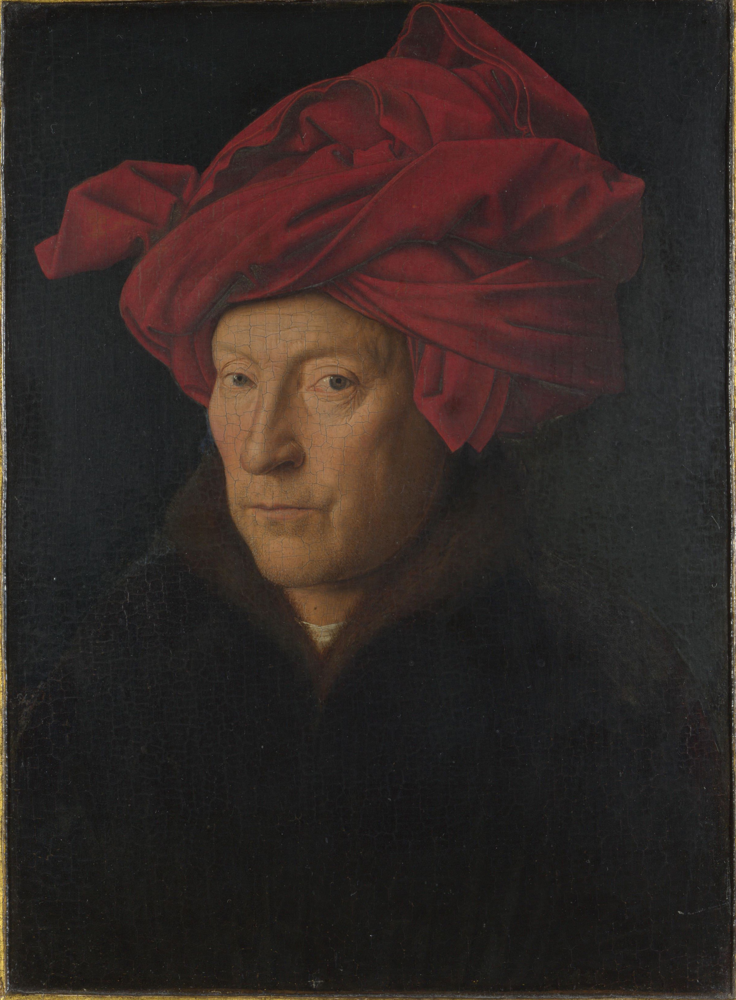

## 基本信息

- 作者：[[凡·艾克 Jan van Eyck]]
- 创作年代：1433 年
- 材质：橡木板上油彩 (*not from wiki*)
- 尺寸：26 × 19 cm (*not from wiki*)
- 现存地：伦敦国家美术馆 The National Gallery, London (*not from wiki*)

## 画面与技法

- 一名中年男子，头戴红色 chaperon（红头巾），目光直视观者。
- (*not from wiki*) 画框上有凡·艾克的铭文："AlC IXH XAN"（"我，尽我所能"）和签名 + 日期，成为他将自己作为"见证者"留在画中的署名习惯之一。
- 课中提及："可能是画家自画像"。如果属实，这是欧洲艺术史上**有记录的最早的独立自画像之一** (*not from wiki*)。
- 极端细密的胡须、眼角皱纹、红头巾褶皱质感，是凡·艾克借助 [[小孔成像法 Camera Obscura]] + 油彩慢干技法的极致展示。

## 历史背景

(*not from wiki*) 这一题材展示了 15 世纪佛兰德斯肖像画的兴起——独立于宗教委托、面向中产/同行的小幅写实肖像，是凡·艾克对欧洲肖像传统的关键贡献。课中顾衡用它说明："如果是画具体的人，凡·艾克的写实是越像越好"——与他画圣母时受困于"模特长什么样就只能画什么样"形成对比。

## 图片清单

| 编号 | 出自 | 描述 |
|---|---|---|
| 01 | [[019｜凡·艾克：什么是绘画的另一种可能性？]] | 整体图 |

## 出现在

- [[019｜凡·艾克：什么是绘画的另一种可能性？]]
