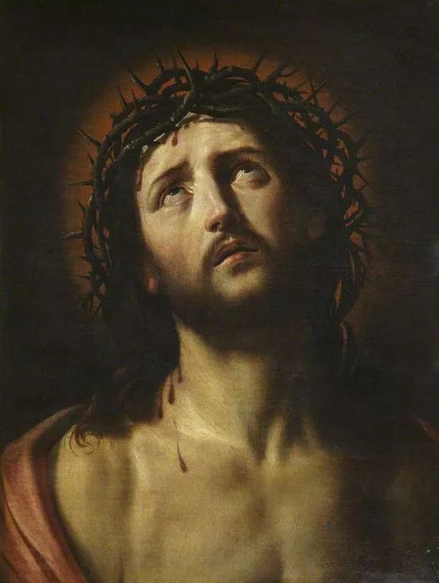

## 基本信息

- 作者：[[圭多·雷尼 Guido Reni]]
- 创作年代：约 1620（顾衡引；雷尼一生多次画此题材，时间常被定在 1620–1625 之间） (*not from wiki*)
- 材质：布面油彩 (*not from wiki*)
- 尺寸：因版本而异（多为半身像格式） (*not from wiki*)
- 现存地：多个版本流传于德累斯顿历代大师画廊 (*Gemäldegalerie Alte Meister*) / 都灵 / 罗马等机构 (*not from wiki*)

## 画面与技法

戴荆冠的耶稣抬头望向画外上方，**双目含泪、嘴角微张**——是 **基督受难前的"瞻仰式"半身像** (*Ecce Homo* / 仰望天父式)。

**保留卡拉瓦乔的戏剧用光、去掉粗俗**（顾衡 023 核心论点）：
- 仍是单方向强光从画外打入——保留了 [[酒窖光 Tenebrism]] 的明暗对比骨架；
- 但人物 **理想化** —— 皮肤白皙光洁、面容清秀、不见血污泥垢；
- 也保留了卡拉瓦乔的 **戏剧性瞬间**（泪光、张嘴）但完全去掉了底层市井气。

这正是 [[特伦特大公会议 Council of Trent]] 之后教会真正想要的产品：**戏剧化 + 庄严 + 易于一眼读懂**。

## 历史背景

(*not from wiki*) [[圭多·雷尼 Guido Reni]] 的 *Ecce Homo* 半身像系列在 17–19 世纪被大量复制、传播——成为天主教虔诚绘画 (*devotional image*) 的标准范式之一，对欧洲一般信众的视觉记忆影响深远。

顾衡 023 用此画作为 **"卡拉瓦乔 → 雷尼" 圆滑版改写** 的关键证据：保留戏剧用光、去掉粗俗——市场（教会）更喜欢这个版本，进而动摇了卡拉瓦乔的地位。

## 图片清单

| 编号 | 出自 | 描述 |
|---|---|---|
| 01 | [[023｜卡拉瓦乔：巴洛克的戏剧性从何而来？]] | 整体图 |

## 出现在

- [[023｜卡拉瓦乔：巴洛克的戏剧性从何而来？]]
