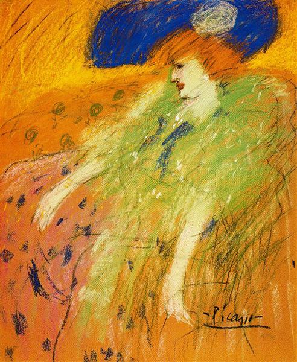

## 基本信息

- 作者：[[毕加索 Pablo Picasso]]
- 创作年代：1901
- 材质：布面油画 (*not from wiki*)
- 尺寸：年代不详 (*not from wiki*)
- 现存地：私人收藏 (*not from wiki*)

## 画面与技法

毕加索 [[蓝色时期 Blue Period]] 初期"兼收并蓄"阶段的作品——本讲判定为 **[[德加 Edgar Degas]] 附体**：构图的近景人物视角、对帽子+脸部光影的处理、对剧场化女性题材的兴趣，都是德加芭蕾舞女系列的直接吸收。色调已显蓝色狂热。

## 历史背景 (*not from wiki*)

- 创作于 1901 年——毕加索由 [[沃拉尔 Ambroise Vollard]] 办首次巴黎个展的年份；展上一幅未卖出，但毕加索此时正全力博采各家。

## 图片清单

| 编号 | 出自 | 描述 |
|---|---|---|
| 01 | [[064｜毕加索1：如何理解"蓝色时期"和"玫瑰红时期"？]] | 整幅画面 |

## 出现在

- [[064｜毕加索1：如何理解"蓝色时期"和"玫瑰红时期"？]]
