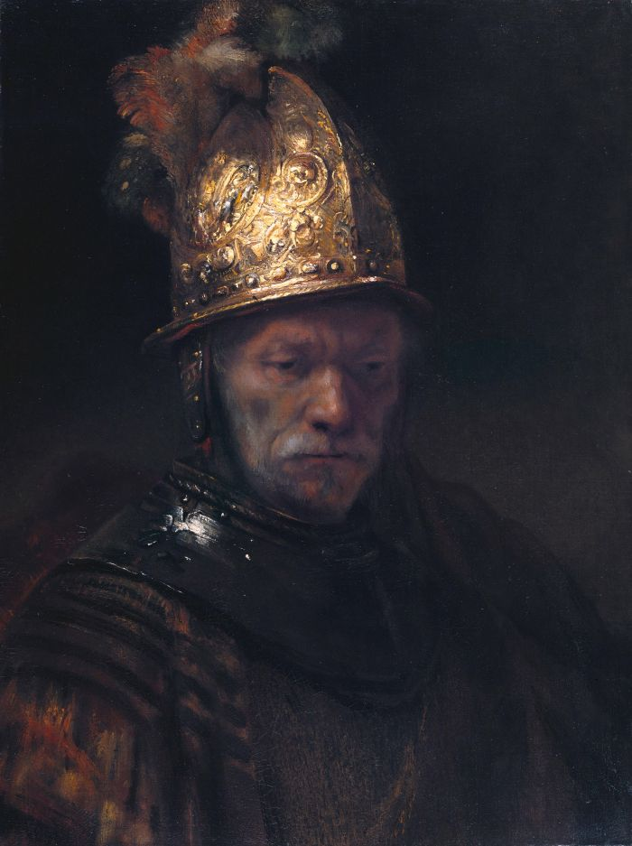

## 基本信息

- 作者：曾长期归于 [[伦勃朗 Rembrandt]]，1985 年柏林国家博物馆经科学鉴定后改为「**伦勃朗工坊**」(circle of Rembrandt) (*not from wiki*)
- 创作年代：约 1650 (*not from wiki*)
- 材质：布面油画 (*not from wiki*)
- 尺寸：约 67.5 × 50.7 cm (*not from wiki*)
- 现存地：柏林国立博物馆 Gemäldegalerie, Berlin (*not from wiki*)

## 画面与技法

胸像构图。一位年长男子戴着造型华丽、布满浮雕的金色头盔，头微微低垂，侧脸沐浴在右上方的强烈侧光中。头盔的金色与背景的黑色形成戏剧性对比，盔上每一道凿痕都被以厚涂的油彩精雕——这正是德语区评论传统所盛赞的"伦勃朗式"对比与材质感。

## 历史背景

(*not from wiki*) 19 世纪起被视为伦勃朗成熟期肖像的代表作之一。1985 年柏林国家博物馆通过 X-ray、颜料分析、笔触比对，认定为伦勃朗工坊一名追随者所作，**而非伦勃朗本人**。

顾衡在 [[001｜总导论：艺术到底属于谁？]] 用它做反面例子：艺术史家 **雅各布·劳什伯格 (Jakob Rosenberg)** 曾写整整一本书赞美这幅画"光彩夺目、精神内涵支配整个画面、伦勃朗彻底将梦幻与真实融合……"，结果作者归属翻案后，那六万多字的主观感受成了悬空的尴尬。这件事被用作"对画感叹好棒呀的解读方式不可靠"的活教材。

## 图片清单

| 编号 | 出自 | 描述 |
|---|---|---|
| 01 | [[001｜总导论：艺术到底属于谁？]] | 整体图 |

## 出现在

- [[001｜总导论：艺术到底属于谁？]]
