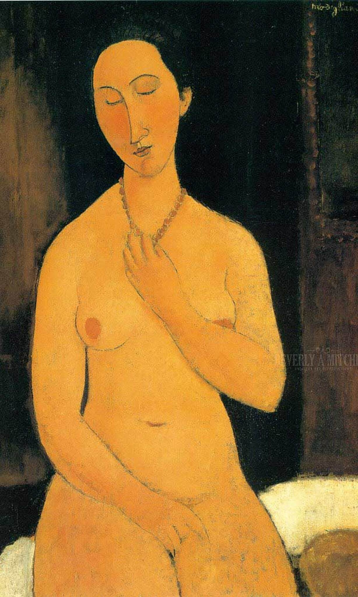

## 基本信息

- 作者：[[莫迪里阿尼 Amedeo Modigliani]]
- 创作年代：1917
- 材质：布面油画 (*not from wiki*)
- 尺寸：(*未知*)
- 现存地：(*未知*)

## 画面与技法

[[莫迪里阿尼 Amedeo Modigliani]] 1917 年裸体画系列。颈项一道**深色项链** = 几乎是唯一具体可标识的装饰元素——除此之外，五官、身材、肤色都是 1917 年莫迪里阿尼**统一程式**的产物。顾衡 078 把它与同系列另两件并列，强调画的是"**抽象的女人**"而非"特定女人"。

## 历史背景 (*not from wiki*)

属 1917 年 Berthe Weill 画廊个展系列；展览因"淫秽"被警方撤展。

## 图片清单

| 编号 | 出自 | 描述 |
|---|---|---|
| 01 | [[078｜莫迪里阿尼：画中女子为什么让人一眼难忘？]] | 戴项链坐姿裸女 |

## 出现在

- [[078｜莫迪里阿尼：画中女子为什么让人一眼难忘？]]
