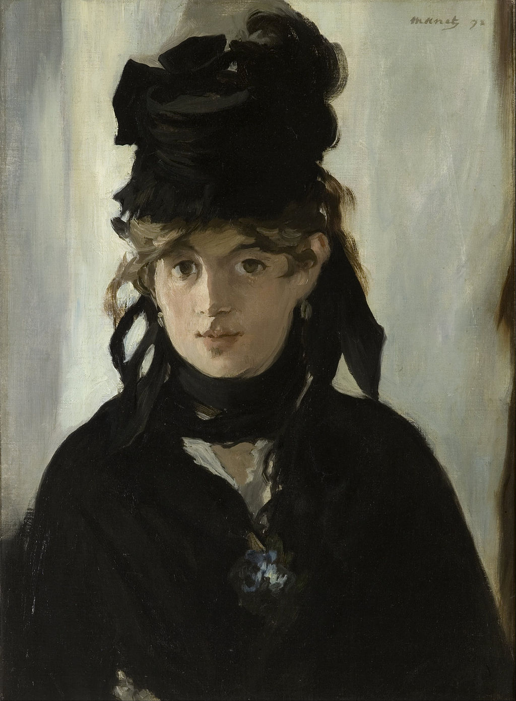

## 基本信息

- 作者：[[马奈 Édouard Manet]]
- 创作年代：1872
- 材质：布面油画 (*not from wiki*)
- 尺寸：55 × 40 cm (*not from wiki*)
- 现存地：巴黎奥赛博物馆 (Musée d'Orsay) (*not from wiki*)

## 画面与技法

[[马奈 Édouard Manet]] 以 [[莫利索 Berthe Morisot]] 为模特创作的多幅肖像中**最有名**的一幅之一——一位身着深色衣裙、手持紫罗兰花束的年轻女性，目光直视观者。深色背景与浅色面孔形成强烈对比——马奈式的"**曝光过度**"光感（参见 [[阳台 The Balcony]]）在面部铺陈出极少的中间色阶。

## 在课程中的角色

顾衡 044 用来说明**马奈与莫利索的师友 / 情感关系**："**马奈也很喜欢莫利索，他以莫利索为模特创作了好几幅画**"——这是引出《[[阳台 The Balcony]]》分析的过渡桥梁。

## 历史背景 (*not from wiki*)

1868 年莫利索经朋友介绍认识马奈，1872 年马奈完成此画。莫利索本人拥有此画多年，后传给家人。1894 年她去世前将之托付亲属，1998 年被卢浮宫 / 奥赛博物馆收购。

## 图片清单

| 编号 | 出自 | 描述 |
|---|---|---|
| 01 | [[044｜莫利索和毕沙罗：最纯正的印象派什么样？]] | 全画，深底+紫罗兰 |

## 出现在

- [[044｜莫利索和毕沙罗：最纯正的印象派什么样？]] —— 马奈以莫利索为模特的代表作之一
- [[马奈 Édouard Manet]] —— 代表作品
- [[莫利索 Berthe Morisot]] —— 作为模特出现
