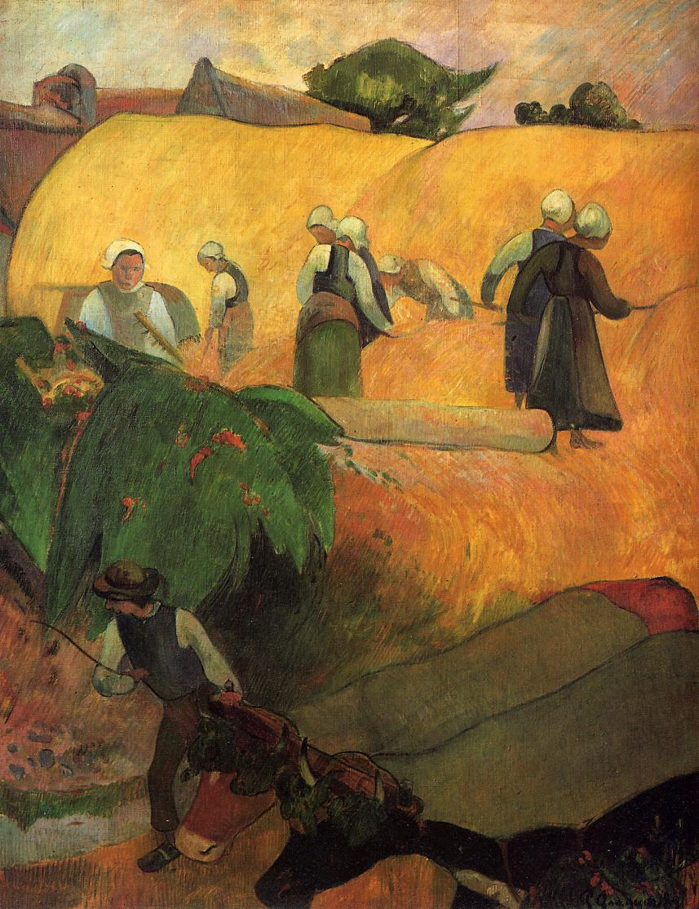

## 基本信息

- 作者: [[高更 Paul Gauguin]]
- 创作年代: 1889
- 材质: 布面油画 (*not from wiki*)
- 尺寸: 年代不详
- 现存地: (*not from wiki*) 考陶尔德画廊 Courtauld Gallery，伦敦（待核）

## 画面与技法

高更马提尼克归来后的转折期作品——顾衡 055 引为[[毕沙罗 Camille Pissarro]]"掠夺式借鉴原始部落文化"判语的样本之一。已经显著偏离[[印象派 Impressionism]]的小笔触/光感印象，向**形状简化 + 大面积色块**的装饰性方向靠拢。

## 历史背景 (*not from wiki*)

1889 高更已驻[[阿旺桥 Pont-Aven]]，与[[贝尔纳 Émile Bernard]]、安奎丹等画家形成松散圈子；本作可视为阿旺桥时期作品。

## 图片清单

| 编号 | 出自 lecture | 描述 |
|---|---|---|
| 01 | [[055｜高更1：为什么从印象派走向象征主义？]] | 全图 |

## 出现在

- [[055｜高更1：为什么从印象派走向象征主义？]]
