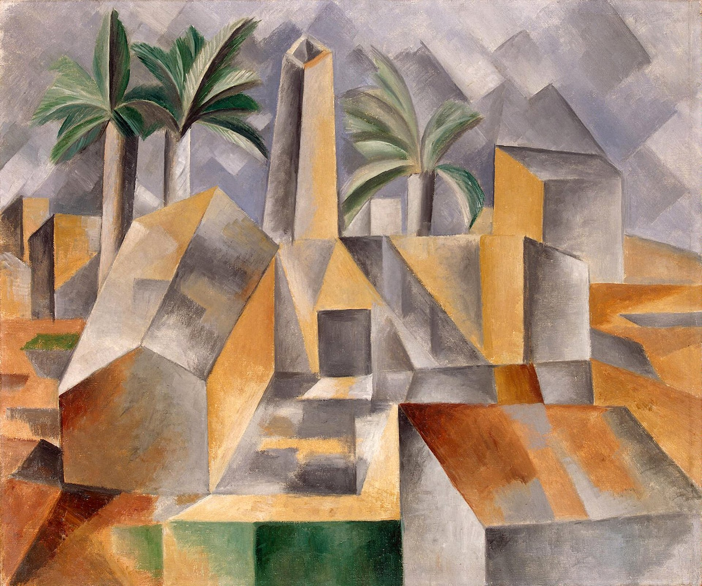

## 基本信息

- 作者：[[毕加索 Pablo Picasso]]
- 创作年代：1909
- 材质：布面油画 (*not from wiki*)
- 尺寸：50.7 × 60.2 cm (*not from wiki*)
- 现存地：埃尔米塔日博物馆 (圣彼得堡) (*not from wiki*)

## 画面与技法

毕加索 1909 年夏在西班牙加泰罗尼亚 Horta de Ebro 附近创作的几何化风景画。**与同期勃拉克的《[[埃斯塔克的房子 Houses at L'Estaque]]》风格高度雷同**——证明两人在草创立体主义阶段沟通之充分。

特点：

- 房屋全部分解为**立方体、楔形、柱体**堆叠
- 几乎抛弃天空与远景，画面被几何切面填满
- 色彩限于赭石、灰绿与铅灰，刻意避开野兽派的高彩度

## 历史背景 (*not from wiki*)

由俄国大收藏家 [[史楚金 Sergei Shchukin]] 购入，今在埃尔米塔日博物馆。常与勃拉克 L'Estaque 风景配对展示，作为**立体主义初期"双胞胎风景"**的范例。

## 图片清单

| 编号 | 出自 | 描述 |
|---|---|---|
| 01 | [[068｜立体主义，除了毕加索还值得了解什么？]] | 与勃拉克 L'Estaque 风景配对的几何化风景 |

## 出现在

- [[068｜立体主义，除了毕加索还值得了解什么？]] —— 与勃拉克 L'Estaque 风景配对呈现
