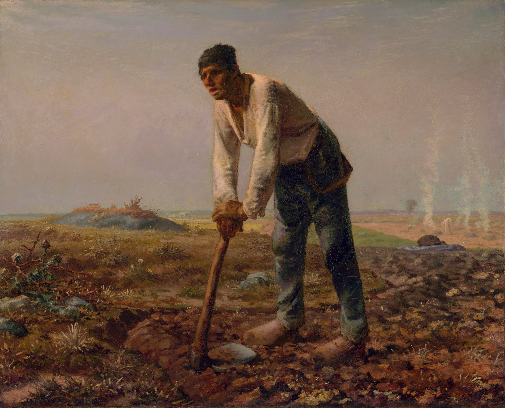

## 基本信息

- **作者**：[[米勒 Jean-François Millet]]
- **创作年代**：1860—1862（顾衡注 1862）
- **材质**：油画，布面 (*not from wiki*)
- **尺寸**：80 × 99 cm (*not from wiki*)
- **现存地**：美国洛杉矶 J. Paul Getty 博物馆 (*not from wiki*)

## 画面与技法

(*not from wiki*) 一个**疲惫不堪、靠在锄头上喘息**的农夫——脸晒得黝黑、嘴半张、眼神迟滞。背景是石头满布、燃烧着杂草的贫瘠土地——大地几乎和他一样苍老。米勒用**沉重的褐色调**和**人物压低的轮廓**制造出**被命运碾压的重感**——与《牧羊女》《晚钟》的牧歌氛围形成强烈反差。

## 历史背景 (*not from wiki*)

1863 年沙龙首展时**引起巨大争议**——保守派把这个农夫读作"危险的、近乎野兽的革命隐患"。19 世纪末美国诗人 Edwin Markham 据此画写出长诗 *The Man with the Hoe*（1899），把画中农夫升级为全球受压迫劳动者的象征——成为美国进步主义运动的文化标志。

## 在课程中的角色

顾衡 036 引述**罗丹的评价**作为本画意义的总结：

> 米勒画了一个可怜的乡下人倚在锄头上叹息的情景。疲劳侵噬，赤日熏蒸，他宛如一头浑身受伤的动物。这可怜的生物对残酷命运的屈服，便成了全人类的象征。

——这段引文是顾衡论证**"米勒在创作过程中是动了真情的"**（与自恋的库尔贝最大的不同）的关键证据。

## 图片清单

| 编号 | 出自 | 描述 |
|---|---|---|
| 01 | [[036｜米勒：什么是"伟大的现实主义"？]] | 全画 |

## 出现在

- [[036｜米勒：什么是"伟大的现实主义"？]] —— 罗丹评语所对应的画作；米勒"动真情"的关键证据
- [[米勒 Jean-François Millet]] —— 代表作
- [[罗丹 Auguste Rodin]] —— 引述对象（如有页）
- [[现实主义 Realism]] —— 农民苦难母题
