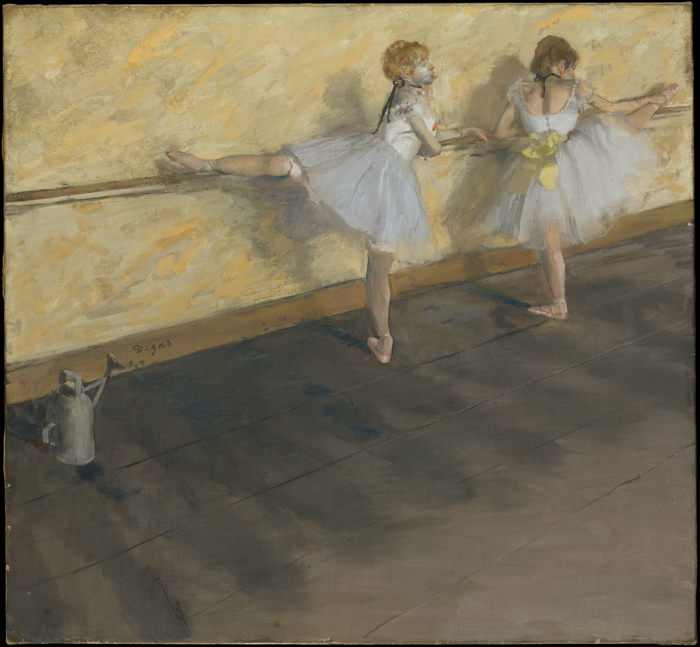

## 基本信息

- 作者：[[德加 Edgar Degas]]
- 创作年代：1905（041 caption）
- 材质：油画 / 粉彩 (*not from wiki*)
- 尺寸：(*not from wiki*)
- 现存地：(*not from wiki*) —— 一说华盛顿菲利普收藏 The Phillips Collection

## 画面与技法

两位芭蕾舞女在练功房把杆前练习。德加晚期标志性的"芭蕾舞女"系列之一。

041 不展开画面分析——本画是**作为拍卖纪录画**出场的——1912 年拍卖中拍出 **43 万法郎**的最高价，**击败了 [[学院派 Academic Art]] 标王 [[梅索尼埃 Ernest Meissonier]]**。

## 历史背景

(*not from wiki*) 德加从 1870 年代起持续创作芭蕾舞女题材。1905 已是其晚年（视力恶化期），多用粉彩。

041 顾衡明示：1912 年的这场拍卖具有三重宣告意义——
1. 印象派针对学院派的全面胜利
2. 资产阶级审美观针对贵族审美观的全面胜利
3. 现代绘画针对古典绘画的全面胜利

而当时印象派核心人物 [[莫奈 Claude Monet]]、[[雷诺阿 Pierre-Auguste Renoir]]、[[德加 Edgar Degas]] **都还在世**——"这一胜利并没有来得太迟"。

## 图片清单

| 编号 | 出自 | 描述 |
|---|---|---|
| 01 | [[041｜莫奈1：颠覆式的创新从何而来？]] | 两舞女在把杆前练习 |

## 出现在

- [[041｜莫奈1：颠覆式的创新从何而来？]]
