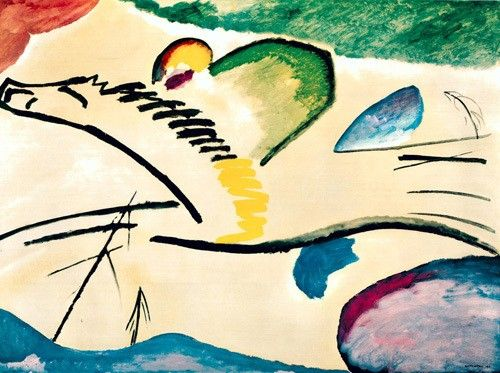

## 基本信息

- 作者：[[康定斯基 Wassily Kandinsky]]
- 创作年代：1911
- 材质：布面油画 (*not from wiki*)
- 尺寸：约 94 × 130 cm (*not from wiki*)
- 现存地：鹿特丹博伊曼斯·范伯宁恩美术馆 (Museum Boijmans Van Beuningen, Rotterdam) (*not from wiki*)

## 画面与技法

顾衡 082 与《[[穆尔瑙的教堂 Murnau with a Church]]》并列，作为康定斯基**渐进抽象**过程的中间样本——看似随意的线条与色彩，但**琴键等具象元素仍清晰可辨**。

## 历史背景 (*not from wiki*)

题材是骑马者扬鞭。同年（1911）康定斯基组建 [[青骑士 Der Blaue Reiter]]，马 / 骑士母题贯穿这一时期。

## 图片清单

| 编号 | 出自 | 描述 |
|---|---|---|
| 01 | [[082｜康定斯基2：他为什么走向抽象？]] | 琴键 / 骑马者形象仍隐约可辨 |

## 出现在

- [[082｜康定斯基2：他为什么走向抽象？]]
