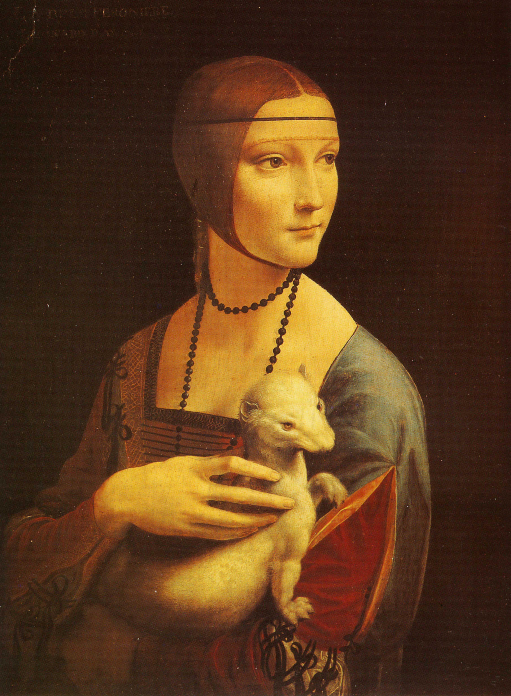

## 基本信息

- 作者：[[达·芬奇 Leonardo da Vinci]]
- 创作年代：约 1489–1490 (*not from wiki*)
- 材质：胡桃木板上油彩
- 尺寸：54 × 39 cm (*not from wiki*)
- 现存地：波兰克拉科夫国家博物馆 (Czartoryski Museum, Kraków) (*not from wiki*)

## 画面与技法

胸像。米兰公爵 卢多维科·斯福尔扎 的情妇 切奇莉亚·加莱拉尼 (Cecilia Gallerani, 1473–1536) 怀抱一只白貂（**ermine = ἐρμίνεον γαλέη / "Galé-" 与她的姓 Gallerani 双关**；同时白貂在文艺复兴是"纯洁 + 公爵勋章"的双重象征——卢多维科 1488 年获那不勒斯国王授予 *Order of the Ermine*）。

**达·芬奇路数的展示**：

- 转身回首的姿态——画面有动感，与之前正侧面或正面的静态肖像不同
- 颈部的细微肌肉变化、手指关节的解剖准确——达芬奇笔记里的人体解剖知识进入肖像
- **晕涂法**的成熟应用——脸庞、衣服、貂毛之间的过渡无锐利线条
- 背景原本是窗景，后世被涂成黑底——影响了对达芬奇空气透视意图的判断

## 历史背景

(*not from wiki*) 达·芬奇 1482 年起在米兰宫廷为卢多维科·斯福尔扎服务，为其情妇作此肖像。1798 年由波兰王子 Adam Czartoryski 从意大利买回；二战中被纳粹劫夺后归还；现为波兰国家级文物。

## 图片清单

| 编号 | 出自 | 描述 |
|---|---|---|
| 01 | [[010｜达芬奇：他为什么一生抑郁不得志？]] | 整体图 |

## 出现在

- [[010｜达芬奇：他为什么一生抑郁不得志？]]
