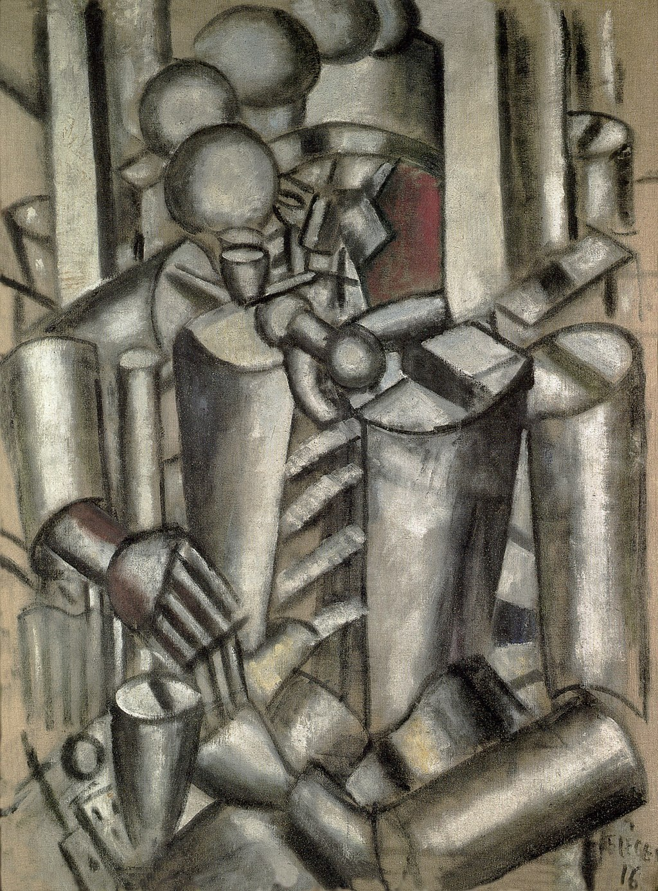

## 基本信息

- 作者：[[莱热 Fernand Léger]]
- 创作年代：1911—1912
- 材质：布面油画 (*not from wiki*)
- 尺寸：约 65 × 50 cm (*not from wiki*)
- 现存地：私人收藏 / 数版本 (*not from wiki*)

## 画面与技法

莱热**"管子主义 (tubism)"**的标志作品之一——画面中所有元素，从士兵的身体到衣褶、烟雾，都被分解为**圆柱体的堆叠**。来源于莱热一战参军时对**闪闪发亮的枪管、炮管**的深刻印象。

顾衡明示："莱热画什么都是由管子组成的。"评论家给他起了**"tubist"**（"管子主义者"）的外号——和"cubist"（立体主义者）形成对仗。

## 历史背景 (*not from wiki*)

莱热入伍前后在战壕里画了一批"战壕生活"主题作品（《[[牌局 (莱热) Soldiers Playing Cards|牌局]]》同属此组）。这些作品**把立体主义与战争经验相结合**，是 20 世纪管状几何美学的源头。

## 图片清单

| 编号 | 出自 | 描述 |
|---|---|---|
| 01 | [[068｜立体主义，除了毕加索还值得了解什么？]] | 圆柱体堆叠的战壕士兵；"管子主义"代表作 |

## 出现在

- [[068｜立体主义，除了毕加索还值得了解什么？]] —— 莱热"管子主义"的代表作
