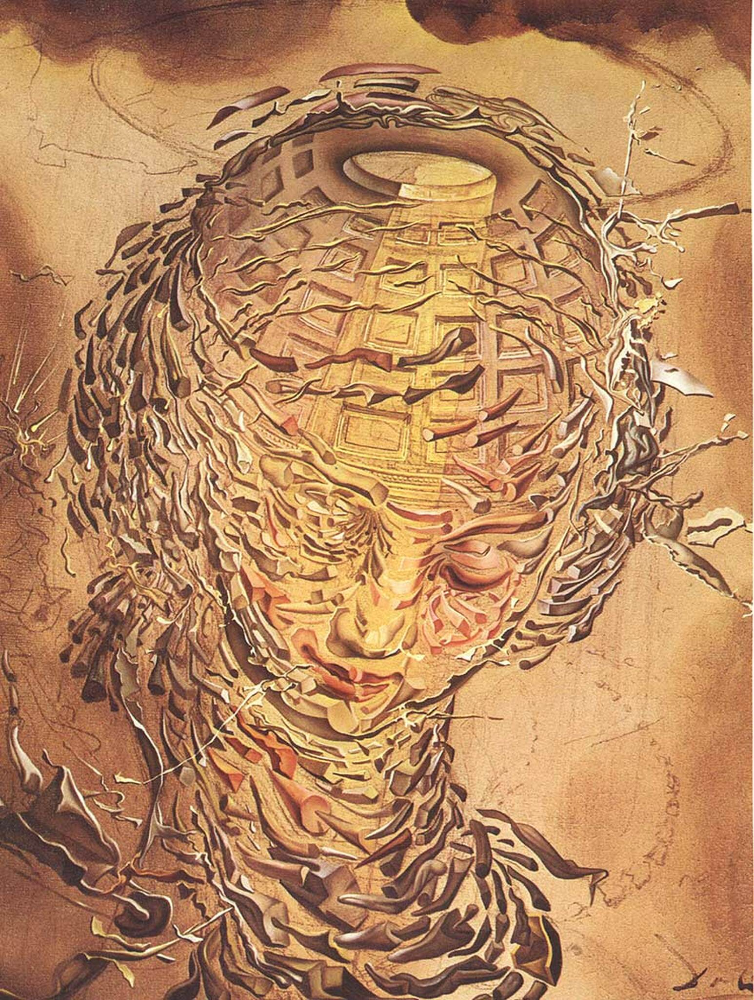

## 基本信息

- 作者：[[达利 Salvador Dalí]]
- 创作年代：1951
- 材质：布面油画 (*not from wiki*)
- 尺寸：(*not from wiki*) 43 × 33 cm
- 现存地：(*not from wiki*) 苏格兰国家现代艺术馆（Scottish National Gallery of Modern Art, Edinburgh）

## 画面与技法

094 中作为达利**蹭核物理流量**期的代表作出场：

> "广岛和长崎炸了两颗原子弹，他就画了《拉斐尔风格爆炸头》和《[[加拉蒂亚 (达利) Galatea of the Spheres]]》，宣布自己进军核物理世界了。"

(*not from wiki*) 把拉斐尔《大公爵的圣母》中圣母的头部"原子化"——头颅外形保留但内部分解为无数旋转的犀牛角状碎片，背景为罗马万神庙穹顶——达利当时称之为他的"**原子主义 / 神秘主义阶段**"（Nuclear Mysticism）。

## 历史背景 (*not from wiki*)

属于达利二战后的**核神秘主义**（Nuclear Mysticism）时期——把核物理意象（爆炸、原子结构、波粒二象性）与古典宗教题材合一，自命为"原子时代的拉斐尔"——也是他**晚年皈依天主教**之前的过渡阶段。

## 图片清单

| 编号 | 出自 | 描述 |
|---|---|---|
| 01 | [[094｜达利：为什么他画的是"伪装的梦"？]] | 全图 |

## 出现在

- [[094｜达利：为什么他画的是"伪装的梦"？]]
