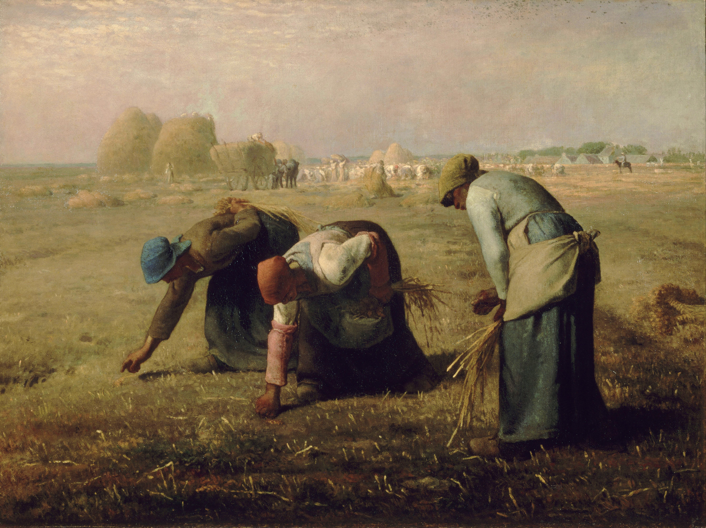

## 基本信息

- **作者**：[[米勒 Jean-François Millet]]
- **创作年代**：1857
- **材质**：油画，布面 (*not from wiki*)
- **尺寸**：83.8 × 111.8 cm (*not from wiki*)
- **现存地**：法国巴黎奥赛博物馆 (*not from wiki*)

## 画面与技法

(*not from wiki*) 三位村中**最穷的妇女**在地主家收割完的田里弯腰拾捡遗落的麦穗——按当时**拾穗权**（glaneuse）习俗法允许。米勒把她们置于**画面前景**、**高出地平线轮廓**——身形被赋予纪念碑式的庄严。最左边那位"左手背在腰上"（顾衡转述）——累得直不起身。远景金色麦垛、收割工人小如蝼蚁、马车与监工骑马而过——**贫富的对照藏在景深里**而非脸上。米勒用**柔和明暗过渡 + 暖金调威尼斯式色彩**——技法不犯学院派忌讳，所以才能在"穷人"主题上**安全过关**（顾衡 036 主线论点）。

## 历史背景 (*not from wiki*)

1857 年沙龙首展时引起部分保守派警觉——"三个穷妇人像是社会主义革命的纪念碑"。但因画家技法温和、政治态度公开消极（米勒名言："艺术家干预政治是不明智的"），未被打压。法兰西第二帝国时期甚至有官方收藏。**与 [[三等车厢 The Third-Class Carriage]]（杜米埃，画穷人也犯忌）的鲜明对比**——同样画穷人，米勒**画的是"农民"**：本土文化与传统道德的监护人（卢梭"高贵的野蛮人"在法国语境下的对应物）——所以不犯忌。

## 在课程中的角色

顾衡 036 的**核心案例**——回答全课主问题"米勒为什么不犯忌"：
- **杜米埃画《三等车厢》→ 政府特别不喜欢**
- **米勒画《拾穗者》→ 没事**
- 区别不在"穷"——拾穗妇人比三等车厢里的乘客**累一百倍**——区别在**身份是农民**。从勃鲁盖尔到米勒，农民画的**400 年传统**在这里收束。

## 图片清单

| 编号 | 出自 | 描述 |
|---|---|---|
| 01 | [[036｜米勒：什么是"伟大的现实主义"？]] | 全画 |

## 出现在

- [[036｜米勒：什么是"伟大的现实主义"？]] —— 米勒"为什么不犯忌"的核心案例
- [[米勒 Jean-François Millet]] —— 代表作
- [[现实主义 Realism]] —— "伟大的现实主义"代表作
