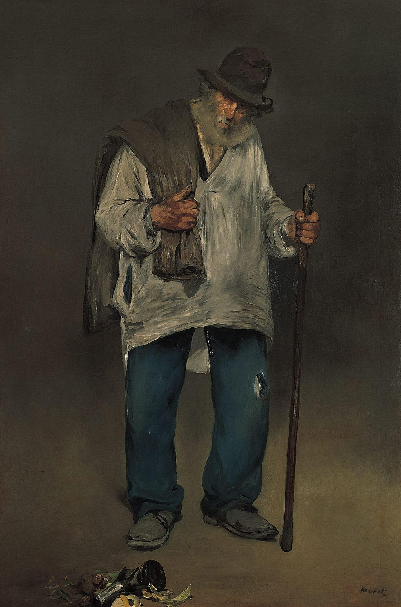

## 基本信息

- 作者：[[马奈 Édouard Manet]]
- 创作年代：1869
- 材质：油彩，画布 (*not from wiki*)
- 尺寸：195 × 130 cm (*not from wiki*)
- 现存地：洛杉矶亨廷顿图书馆 The Huntington (*not from wiki*)

## 画面与技法

[[马奈 Édouard Manet]] 的"巴黎哲学家"系列之一——画一位拾荒老人，伫立空白背景前，破衣旧帽、握杖叼烟。这一系列是马奈对委拉斯贵支（[[委拉斯贵支 Diego Velázquez]]）的致敬 (*not from wiki*)。被顾衡列为"空虚和焦虑的时代精神"代表作之一。

## 历史背景 (*not from wiki*)

["拾荒者"]是 19 世纪 [[本雅明 Walter Benjamin]] 著名笔下的现代都市核心象征——拾捡现代社会的废弃物碎片，与画家"拾捡时代视觉碎片"形成同构。在马奈这里，拾荒者获得了与英雄、君主同等的画幅尊严，是对学院派题材等级的根本性挑战。

## 图片清单

| 编号 | 出自 | 描述 |
|---|---|---|
| 01 | [[038｜马奈1：为什么他是西方现代绘画的鼻祖？]] | 全图 |

## 出现在

- [[038｜马奈1：为什么他是西方现代绘画的鼻祖？]]
