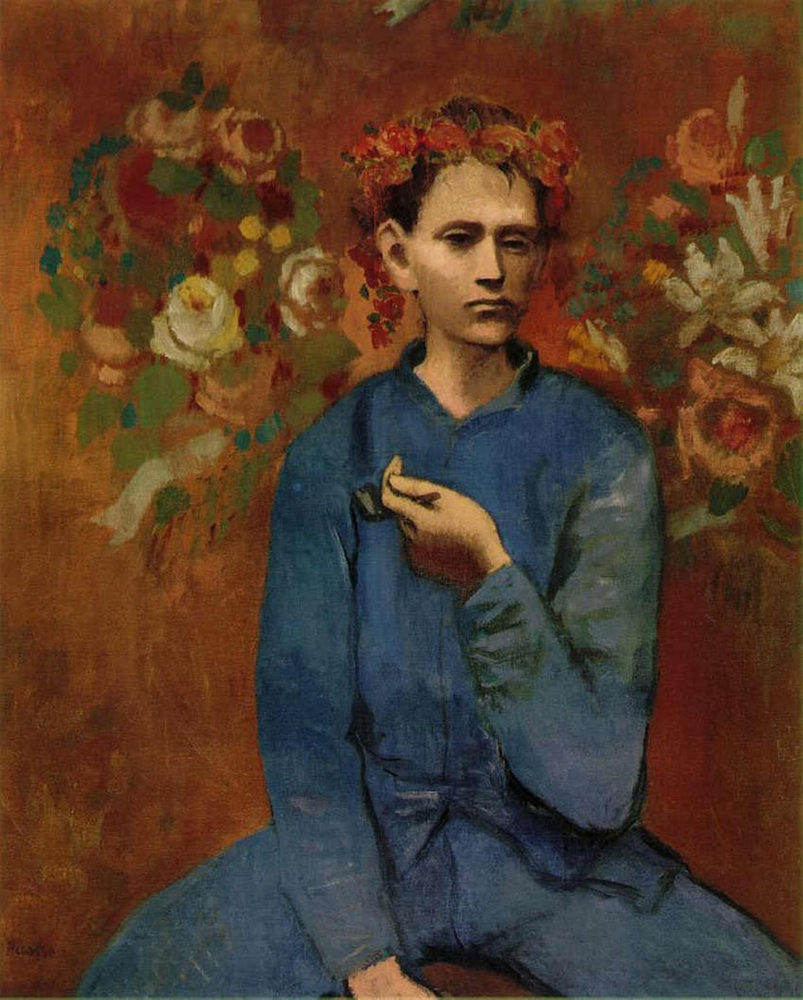

## 基本信息

- 作者：[[毕加索 Pablo Picasso]]
- 创作年代：1905
- 材质：布面油画 (*not from wiki*)
- 尺寸：100 × 81.3 cm (*not from wiki*)
- 现存地：私人收藏（2004 年 Sotheby's 拍出 1.04 亿美元创当时纪录） (*not from wiki*)

## 画面与技法

[[玫瑰红时期 Rose Period]] 最负盛名的作品之一——男孩手持烟斗、头戴花冠、坐姿正对观者。色调玫瑰红+灰，造型仍延续 [[夏凡纳 Pierre Puvis de Chavannes]] 式简化 + [[埃尔·格列柯 El Greco]] 式拉长 / 舞台定格。本讲（064）将其与 [[穿衬衫的女人 Woman in a Chemise]]、[[不快乐的母亲和孩子 Mother and Child (Picasso)]] 一同列为 **"玫瑰红时期只是换色"** 的样本——男孩脸上"没有一点点开心的样子"。

模特通称 *p'tit Louis*，是 Bateau-Lavoir 工作室附近的一个少年。 (*not from wiki*)

## 历史背景 (*not from wiki*)

- 创作于巴黎 Bateau-Lavoir 工作室。
- 2004 年 5 月 5 日在纽约 Sotheby's 拍出 104,168,000 美元，是当时艺术品拍卖最高纪录。

## 图片清单

| 编号 | 出自 | 描述 |
|---|---|---|
| 01 | [[064｜毕加索1：如何理解"蓝色时期"和"玫瑰红时期"？]] | 整幅画面 |

## 出现在

- [[064｜毕加索1：如何理解"蓝色时期"和"玫瑰红时期"？]]
