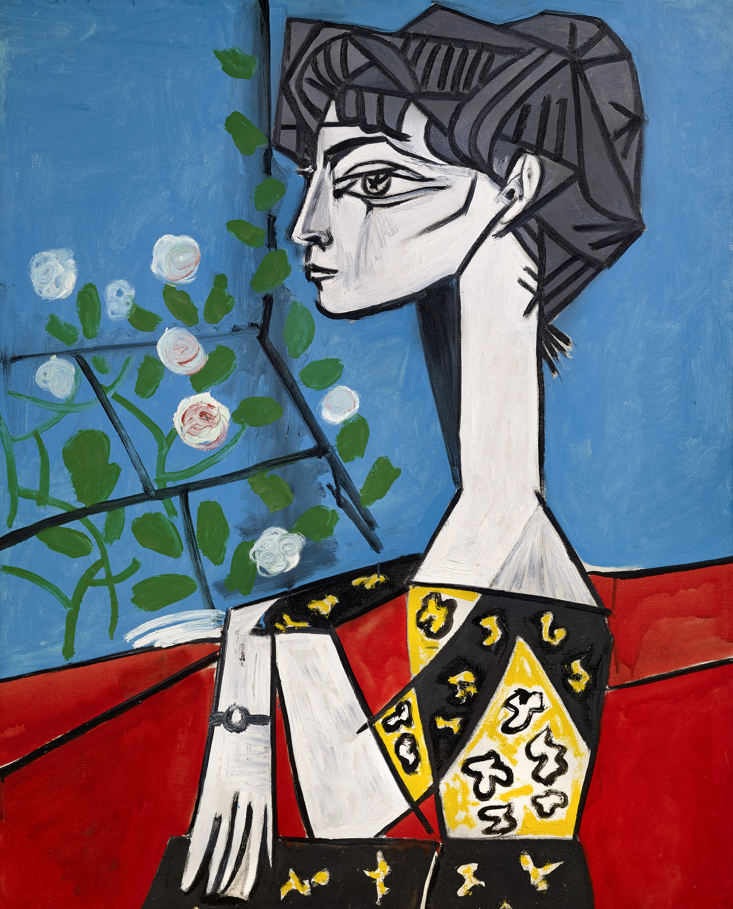

## 基本信息

- 作者：[[毕加索 Pablo Picasso]]
- 创作年代：1954
- 材质：(*not from wiki*) 布面油画
- 尺寸：(*not from wiki*) 100 × 81 cm
- 现存地：(*not from wiki*) 私人收藏

## 画面与技法

模特为毕加索第二任妻子 [[杰奎琳·罗克 Jacqueline Roque]]。画面延续 1932 年《[[梦 (毕加索) Dream (Picasso)]]》的"双脸合体 / 几何曲线"范式——长颈、侧脸、手持花束、纤细几何身躯——是 [[综合立体主义 Synthetic Cubism]] 晚期"皇后肖像"风格的样本。

顾衡 067 列入"为情人画肖像、风格高度雷同"的最末样本——也是毕加索一辈子绘画生涯的尾段。

## 历史背景

(*not from wiki*) 杰奎琳·罗克 (Jacqueline Roque, 1927-1986) 是毕加索 1953 年（她 26 岁、毕加索 72 岁）起的情人，1961 年正式结婚（毕加索 80 岁）。毕加索 1973 年去世前的 20 年间为她画了 400 多幅肖像，是毕加索画过最多次的人。1986 年她于毕加索墓前开枪自杀。

## 图片清单

| 编号 | 出自 | 描述 |
|---|---|---|
| 01 | [[067｜毕加索4：什么是综合立体主义？]] | 整体图（杰奎琳是毕加索的第二任妻子） |

## 出现在

- [[067｜毕加索4：什么是综合立体主义？]]
