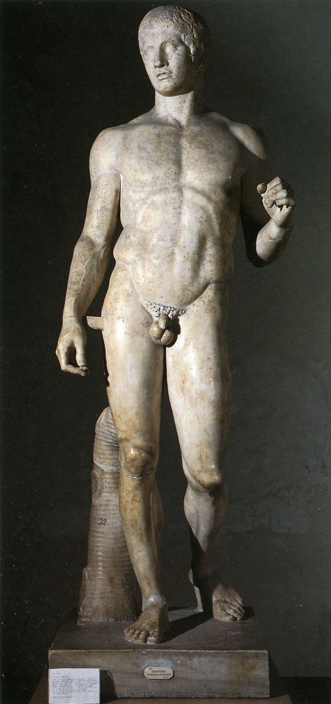

## 基本信息
- 作者：[[波利克列特斯 Polykleitos]]
- 创作年代：青铜原件约公元前 440 年
- 材质：青铜（原件已佚，现存均为罗马时期的大理石复制品）
- 现存地：那不勒斯国立考古博物馆等 (*not from wiki*)

## 画面与技法
- [[S 造型 Contrapposto]] 的标志性范例：左膝低于右膝、右胯骨高于左、左肩高于右
- 是 [[波利克列特斯 Polykleitos]] 用以演示其 [[七头身比例 Seven-head canon]] 的具体物化
- 青铜原件以 [[失蜡法 Lost-wax casting]] 铸造

## 历史背景 (*not from wiki*)
青铜原件几乎可以确定已被熔毁回收（古代金属雕像的常见命运）。现存十余件全身大理石复制品和大量局部复制品，是西方雕塑教学最重要的标准范本之一。

## 图片清单

| 编号 | 出自 | 描述 |
|---|---|---|
| 01 | [[002｜古希腊雕塑：为什么做得这么逼真？]] | 大理石复制品全身正面照 |

<!-- src: https://piccdn3.umiwi.com/img/202103/10/202103101320219068094640.jpg -->

## 出现在
- [[002｜古希腊雕塑：为什么做得这么逼真？]]
