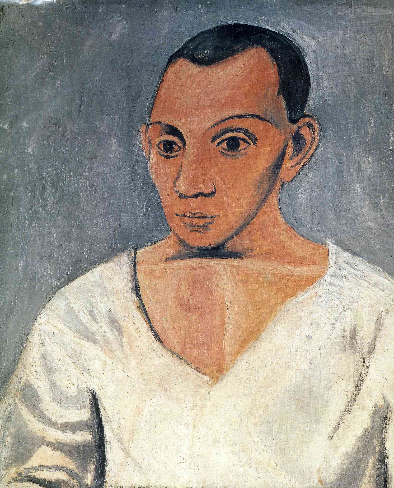

## 基本信息

- 作者：[[毕加索 Pablo Picasso]]
- 创作年代：1906
- 材质：油彩，画布 (*not from wiki*)
- 尺寸：(*not from wiki*) 约 91.9 × 73.3 cm
- 现存地：(*not from wiki*) 费城艺术博物馆 (Philadelphia Museum of Art)

## 画面与技法

毕加索 1906 年的自画像，与《[[格特鲁德·斯坦因肖像 Portrait of Gertrude Stein|斯坦因肖像]]》使用**同一套程式化几何风**——脸型、鼻子、眼睛的造型都呈现明显的[[古埃及艺术 Ancient Egyptian Art|古埃及面具风]]：脸的轮廓被简化为面具状椭圆，眼睛形状对称化、扁平化。

顾衡的判断："**相像的显然只是两幅肖像**，一种追求几何风的程式化"——也就是说，[[毕加索 Pablo Picasso]] 的"骨似"宣言在这里被自己拆穿：斯坦因长得像这幅肖像并不是因为她本人骨架如此，而是因为**毕加索此时所有的肖像都长这个样**。

## 历史背景 (*not from wiki*)

- 作于 1906 年秋，[[毕加索 Pablo Picasso]] 25 岁——也是斯坦因肖像收尾的时段。
- 1950 年代被费城艺术博物馆 A. E. Gallatin 收藏品并入馆藏。

## 图片清单

| 编号 | 出自 | 描述 |
|---|---|---|
| 01 | [[065｜毕加索2：如何理解"黑人时期"？]] | 全图——同期程式化几何风的自我样本 |

## 出现在

- [[065｜毕加索2：如何理解"黑人时期"？]] —— 与《[[格特鲁德·斯坦因肖像 Portrait of Gertrude Stein|斯坦因肖像]]》对照、揭示"骨似"其实是程式化
