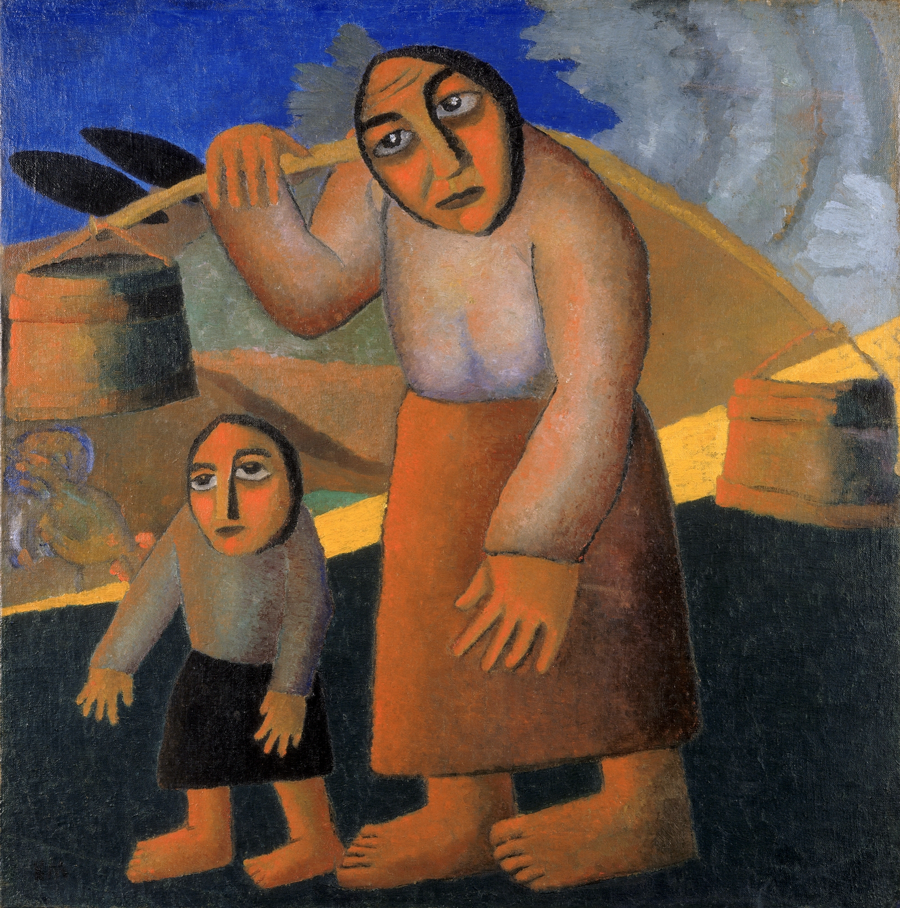
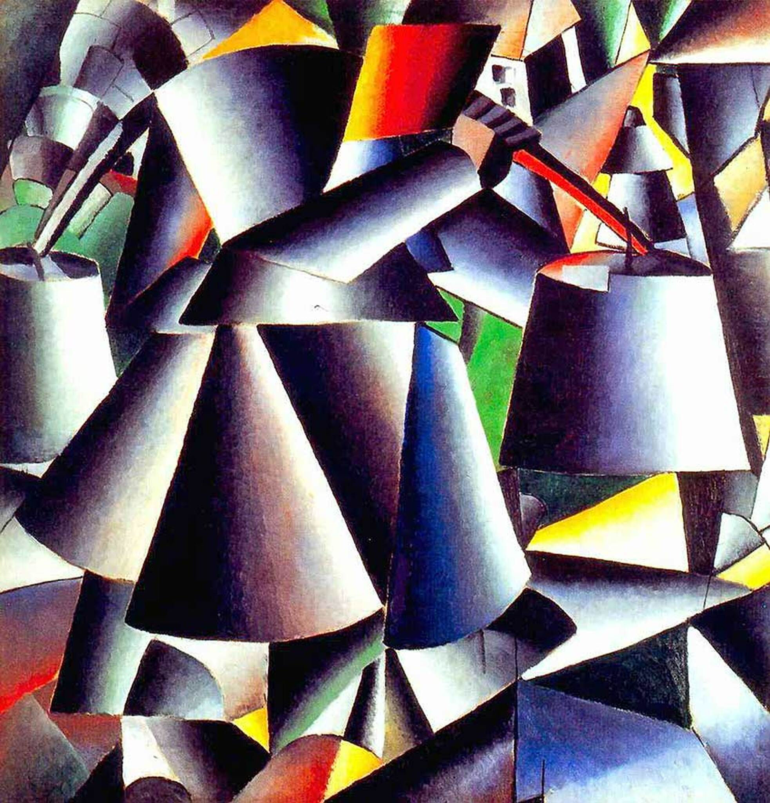

## 基本信息

- 作者：[[马列维奇 Kazimir Malevich]]
- 创作年代：1912
- 材质：布面油画 (*not from wiki*)
- 尺寸：年代不详 (*not from wiki*)
- 现存地：荷兰阿姆斯特丹市立博物馆 (*not from wiki*)

## 画面与技法

顾衡 083 强调："马列维奇两幅一动一静的《挑水桶的农妇和小孩》，其实是最直观地展示了 [[立体主义 Cubism]] 与 [[未来主义 Futurism]] 二者之间的关系和传承。"

- **01** —— 静态版（立体主义构图）：圆柱体分解 + 俄罗斯民俗
- **02** —— 动态版（未来主义构图）：在立体主义骨架上加入运动的多帧叠合，与 [[杜尚 Marcel Duchamp]] [[下楼梯的裸女 Nude Descending a Staircase No. 2]] 同期思路

## 图片清单

| 编号 | 出自 | 描述 |
|---|---|---|
| 01 | [[083｜马列维奇：什么是至上主义？]] | 静态版 (立体主义) |
| 02 | [[083｜马列维奇：什么是至上主义？]] | 动态版 (未来主义) |

## 出现在

- [[083｜马列维奇：什么是至上主义？]]
