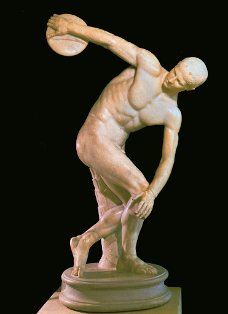

## 基本信息
- 作者：[[米隆 Myron]]
- 创作年代：青铜原件约公元前 450 年
- 材质：青铜（原件已佚）
- 现存地：罗马国立博物馆、大英博物馆等多件大理石复制品 (*not from wiki*)

## 画面与技法
- 把"掷铁饼瞬间"的动作凝固在雕塑里，是希腊雕塑从静态走向动态表现的里程碑
- 青铜原件以 [[失蜡法 Lost-wax casting]] 铸造
- 与 [[持矛者 Doryphoros]] 的静态 [[S 造型 Contrapposto]] 形成动态对比

## 历史背景 (*not from wiki*)
原件已佚，现存约十余件罗马帝国时期的大理石复制品。最著名的复制品包括罗马国立博物馆藏 *Lancellotti Discobolus* 与大英博物馆的 *Townley Discobolus*。

## 图片清单

| 编号 | 出自 | 描述 |
|---|---|---|
| 01 | [[002｜古希腊雕塑：为什么做得这么逼真？]] | 大理石复制品 |

<!-- src: https://piccdn3.umiwi.com/img/202103/10/202103101348436079601842.jpg -->

## 出现在
- [[002｜古希腊雕塑：为什么做得这么逼真？]]
