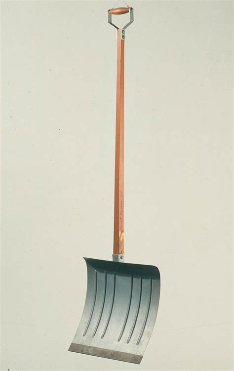

## 基本信息

- 作者：[[杜尚 Marcel Duchamp]]
- 创作年代：1915（杜尚抵美后第一件现成品） (*not from wiki*)
- 材质：现成品——市售木柄铁制雪铲（snow shovel），杜尚签名并刻题铭 (*not from wiki*)
- 尺寸：长约 132 cm (*not from wiki*)
- 现存地：耶鲁大学美术馆 (Yale University Art Gallery) (*not from wiki*)

## 画面与技法

杜尚 1915 年抵达纽约不久，在五金店买了一把**雪铲**，签上自己的名字 + 题铭 *"In Advance of the Broken Arm"*，悬挂在天花板上——他的第一件**在美国创作的 [[现成品 Readymade]]**，也是杜尚自己第一次正式使用 "readymade" 一词来命名作品类型。(*not from wiki*)

题铭语义模糊——既可读为"在断臂之前 [发生的事]"（暗示铲雪太用力会断手）也可读为"提前的断臂 / 预知的伤"——是杜尚式标题"开门让观众进来一起做"的典型操作。

## 历史背景

(*not from wiki*) 与《[[自行车轮 (杜尚) Bicycle Wheel]]》《[[瓶架 (杜尚) Bottle Rack]]》一起构成杜尚 1913–1915 三件最早的现成品。原件遗失；后续多次复制。

## 图片清单

| 编号 | 出自 | 描述 |
|---|---|---|
| 01 | [[090｜杜尚3：他为什么要送一个小便器去参展？]] | 悬挂的雪铲 |

## 出现在

- [[090｜杜尚3：他为什么要送一个小便器去参展？]]
