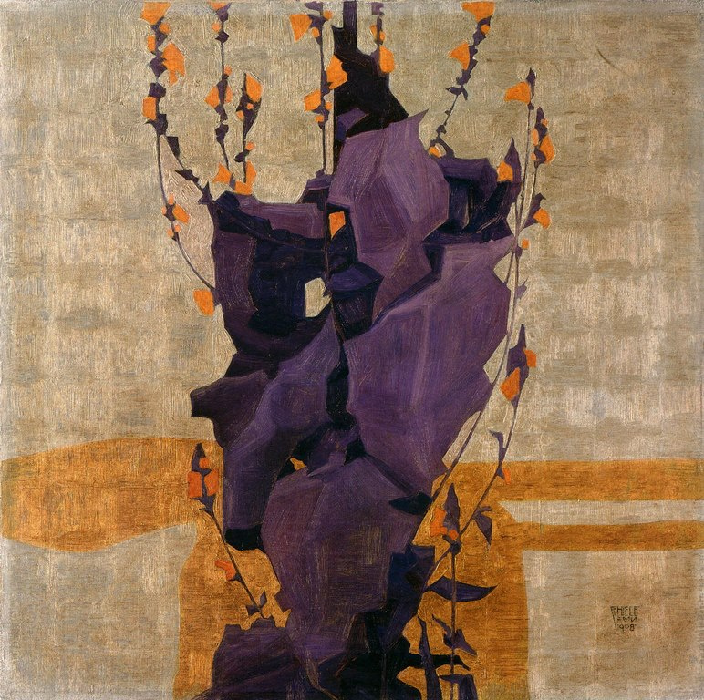

## 基本信息

- 作者：[[席勒 Egon Schiele]]
- 创作年代：1908
- 材质：（*not from wiki*）纸本 / 水彩 + 不透明颜料
- 尺寸：（*not from wiki*）暂缺
- 现存地：（*not from wiki*）暂缺

## 画面与技法

顾衡 074 列于席勒"装饰 / 设计期"——他经 [[克里姆特 Gustav Klimt]] 引荐加入 [[维也纳工坊 Wiener Werkstätte]] 后，**主要工作是设计男装**（"席勒特别臭美，最大的爱好就是照镜子"）；《插花》是同一装饰 / 平面化趣味在花卉小品上的应用：色块平涂、轮廓清晰、近 [[青年风格 Jugendstil]] / [[新艺术运动 Art Nouveau]] 装饰传统。

## 历史背景 (*not from wiki*)

- 1908 = 克里姆特为席勒张罗第一次个人画展的同一年——席勒首次走进大众视野
- 维也纳工坊期席勒的装饰作品**风格上更接近克里姆特 / Jugendstil**，与 1910 起的"残缺人物"路线判然有别

## 图片清单

| 编号 | 出自 | 描述 |
|---|---|---|
| 01 | [[074｜席勒1：他为什么走向表现主义？]] | 全图 |

## 出现在

- [[074｜席勒1：他为什么走向表现主义？]]
