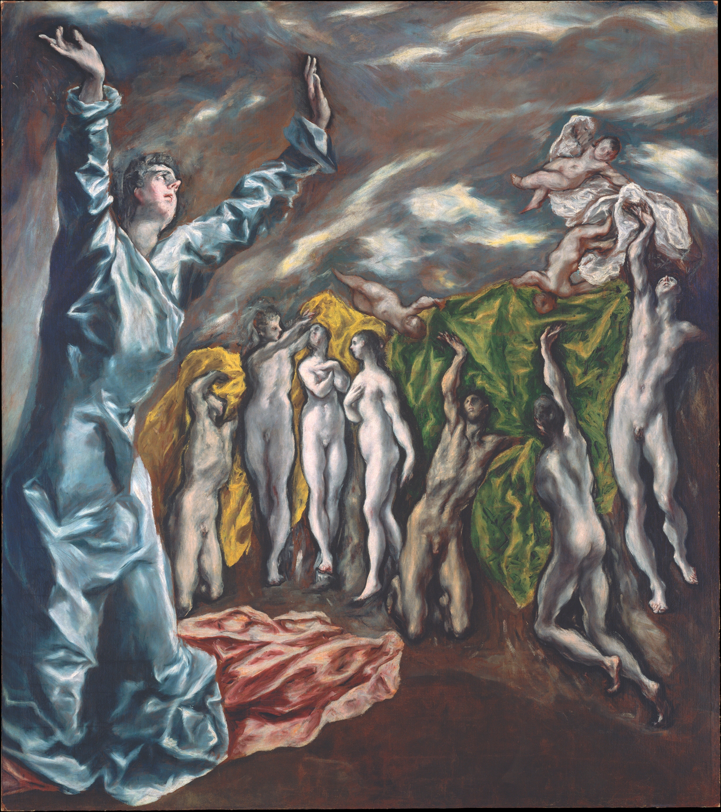

## 基本信息

- 作者：[[埃尔·格列柯 El Greco]]
- 创作年代：1608—1614
- 材质：油彩，画布 (*not from wiki*)
- 尺寸：(*not from wiki*) 约 224.8 × 199.4 cm
- 现存地：(*not from wiki*) 纽约大都会艺术博物馆 (The Met)

## 画面与技法

[[埃尔·格列柯 El Greco]] 晚期 [[矫饰主义 Mannerism|矫饰主义]] 巅峰作之一——典型的拉长比例、扭曲造型、戏剧化光影与超自然蓝绿色调。

画面叙事来自 [[新约 New Testament|《启示录》]] 第 6 章——左前景跪着的人是**施洗者圣约翰**（顾衡的描述）（学界另一说为**福音书作者圣约翰**），双手举向空中，**恳求上帝惩恶扬善、给世界一个公正的判决**；画面深处则是为信仰殉道的灵魂们正在接受白袍。

**画面深处的女性裸体群组**——顾衡指出，这相当于 [[美惠三女神 Three Graces|美惠三女神]] 母题的延续。这一群组在 300 年后被 [[毕加索 Pablo Picasso]] **搬到前景**、变身为《[[亚威农少女 Les Demoiselles d'Avignon|亚威农少女]]》的妓女——构成两幅画 300 年的对话。

## 历史背景 (*not from wiki*)

- 作于格列柯晚年托雷多（Toledo）时期，是为 Tavera 医院教堂祭坛而画的更大组画的残存部分——原画顶部被裁剪，致使现存版本看上去比例失衡。
- 20 世纪初被法国画商兼收藏家 Zuloaga 拥有，**毕加索 1907 年画《亚威农少女》前曾多次在 Zuloaga 工作室见到此画**——这就是顾衡所说"构图自来于格列柯"的物质基础。
- 是 [[毕加索 Pablo Picasso]] 一生反复致敬的格列柯作品之一。

## 图片清单

| 编号 | 出自 | 描述 |
|---|---|---|
| 01 | [[065｜毕加索2：如何理解"黑人时期"？]] | 全图——《亚威农少女》构图蓝本 |

## 出现在

- [[065｜毕加索2：如何理解"黑人时期"？]] —— 作为《[[亚威农少女 Les Demoiselles d'Avignon]]》的构图蓝本被引用
