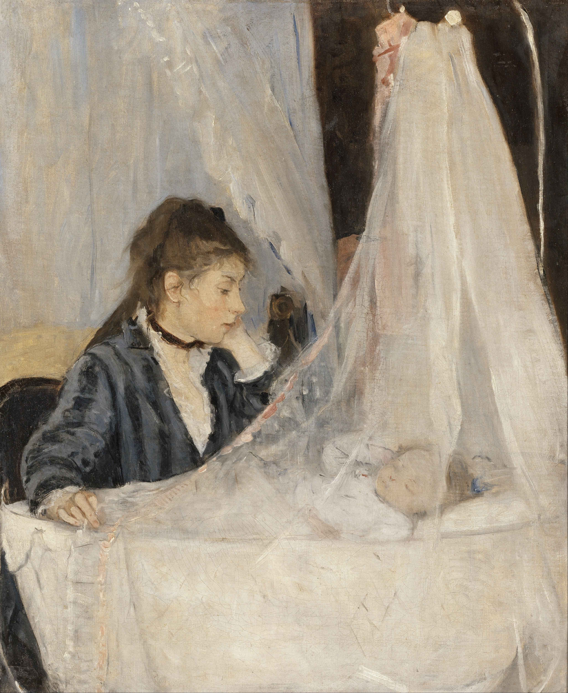

## 基本信息

- 作者：[[莫利索 Berthe Morisot]]
- 创作年代：1872
- 材质：布面油画 (*not from wiki*)
- 尺寸：56 × 46 cm (*not from wiki*)
- 现存地：巴黎奥赛博物馆 Musée d'Orsay (*not from wiki*)

## 画面与技法

[[莫利索 Berthe Morisot]] 最著名的作品之一——画面是莫利索的姐姐艾德玛凝视婴儿摇篮的场景。**白色纱帐**几乎占满画面右上三分之二——纱帐的半透明感由极其轻柔的小色块叠加而成；母亲深色衣裙与白色摇篮形成强对比。整幅画把莫利索"**精致的明暗过渡 + 奔放运笔 + 女性细腻**"三条核心竞争力（顾衡 044 列出）一次性展示——这是她从 [[柯罗 Camille Corot]] / [[马奈 Édouard Manet]] / 自身天分**三条路径汇合**的作品。

## 在课程中的角色

顾衡 044 把它列入莫利索"**贯彻印象派理念的样本组**"。本作 1874 年首届印象派画展即展出（*not from wiki*）——是莫利索作为印象派创始一代核心成员的最早公开身份证明。

## 历史背景 (*not from wiki*)

- 模特：莫利索的姐姐艾德玛·蓬蒂荣 Edma Pontillon 及其新生女儿
- 1874 年 4 月在法国摄影师纳达尔工作室举办的**首届印象派画展**展出——莫利索是参展者中唯一的女性

## 图片清单

| 编号 | 出自 | 描述 |
|---|---|---|
| 01 | [[044｜莫利索和毕沙罗：最纯正的印象派什么样？]] | 全画 |

## 出现在

- [[044｜莫利索和毕沙罗：最纯正的印象派什么样？]] —— 莫利索"印象派教科书"样本之一
- [[莫利索 Berthe Morisot]] —— 代表作之一
