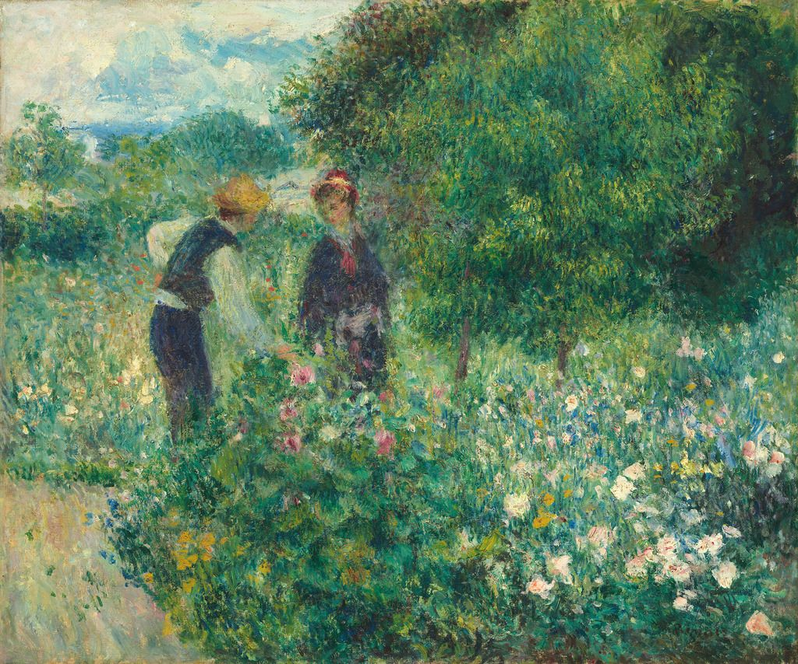

## 基本信息

- 作者：[[雷诺阿 Pierre-Auguste Renoir]]
- 创作年代：1875
- 材质：布面油画 (*not from wiki*)
- 尺寸：54 × 65 cm (*not from wiki*)
- 现存地：(*not from wiki*) 美国国家美术馆 National Gallery of Art, Washington D.C.

## 画面与技法

043 顾衡与《[[女人在花园里 Woman at the Garden (Renoir)]]》并列为"雷诺阿印象派杰作"的代表——印象派细碎光斑与可读形象的同步保留。

## 历史背景 (*not from wiki*)

1875 年雷诺阿正处于早期印象派核心阶段，第二届印象派画展前夕。此作未参展于印象派任何一届，属较小尺幅的自留作品。

## 图片清单

| 编号 | 出自 | 描述 |
|---|---|---|
| 01 | [[043｜雷诺阿：妥协如何造就大师？]] | 全图，林间摘花的女子 |

## 出现在

- [[043｜雷诺阿：妥协如何造就大师？]]
