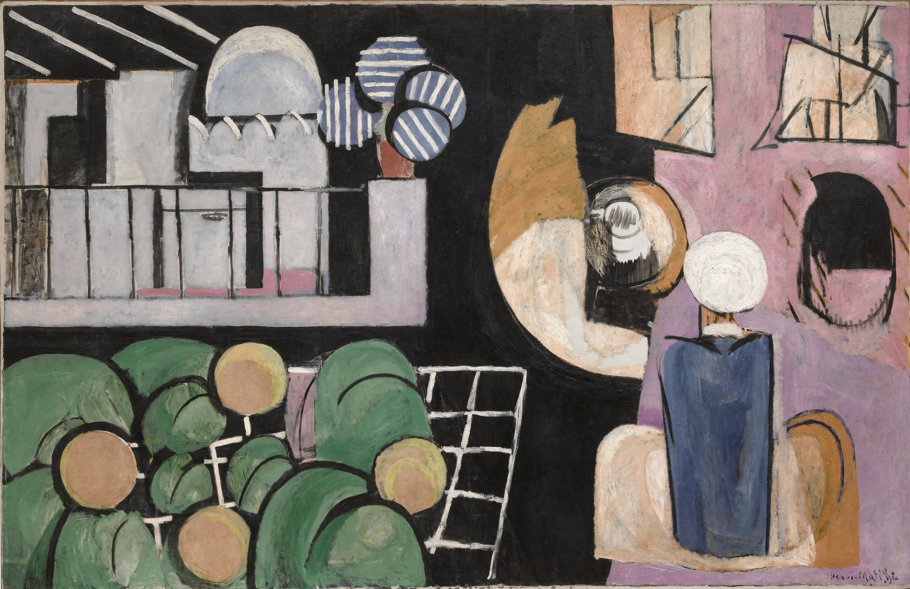

## 基本信息

- 作者：[[马蒂斯 Henri Matisse]]
- 创作年代：1915—1916
- 材质：布面油画 (*not from wiki*)
- 尺寸：181.3 × 279.4 cm (*not from wiki*)
- 现存地：纽约现代艺术博物馆 (MoMA) (*not from wiki*)

## 画面与技法

马蒂斯**立体主义时期**另一代表作，取材于他 1912–1913 年两次摩洛哥之行的回忆。画面被**大块黑色色域**切分为三个区域：左上清真寺与瓜果静物、右上拱门与人物、底部俯瞰戴白头巾的摩洛哥男子群像。

顾衡视角：与《[[钢琴课 (马蒂斯) The Piano Lesson|钢琴课]]》一样，是把所有元素**严格几何化**的产物——并不是分析或综合立体主义，**只是套用了勃拉克的几何思路**。

## 历史背景 (*not from wiki*)

是马蒂斯一战期间最重要、最先锋的作品之一。其后他逐步退回到《[[读书的女人 (马蒂斯) Woman Reading (Matisse)|端坐的女人]]》一类抒情母题，本时期短暂结束。

## 图片清单

| 编号 | 出自 | 描述 |
|---|---|---|
| 01 | [[068｜立体主义，除了毕加索还值得了解什么？]] | 黑色色域分割的"立体主义时期"代表作 |

## 出现在

- [[068｜立体主义，除了毕加索还值得了解什么？]] —— 马蒂斯"立体主义客串"代表作
