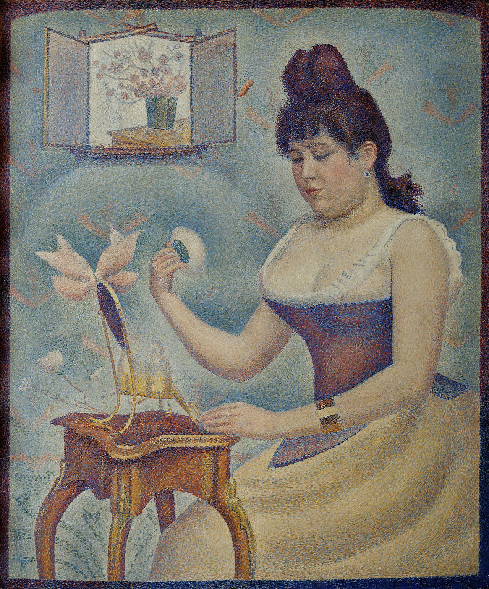

## 基本信息

- **作者**：[[修拉 Georges Seurat]]
- **创作年代**：1889–1890
- **材质**：(*not from wiki*) 布面油画
- **尺寸**：(*not from wiki*) 95.5 × 79.5 cm
- **现存地**：(*not from wiki*) 伦敦考陶尔德画廊 (Courtauld Gallery)
- **模特**：**修拉的妻子** Madeleine Knobloch（*not from wiki*）—— 顾衡 047 明示

## 画面与技法

修拉成熟期 [[分色主义 Divisionism]] / [[点彩 Pointillism]] 室内肖像。在 047 中**作为修拉传记叙事的转折物**出场——顾衡用这幅画的模特身份，引出修拉**32 岁死于白喉**后妻子贱卖《[[大碗岛的星期天下午 A Sunday Afternoon on the Island of La Grande Jatte]]》《[[马戏 The Circus]]》的市场冷遇：

> "修拉 32 岁时死于白喉，他的妻子，**也就是《擦粉的少女》这幅画的模特**，在 1901 年卖掉了修拉点小点点点了好几年的《大碗岛》和《马戏团》，分别只卖了 800 法郎和 500 法郎。"

技术上**仍然是标准小圆点 + 22 色色轮**；与同期《[[康康舞 The Can-can]]》相比更近似《大碗岛》阶段的工程纪律。

## 历史背景 *(not from wiki)*

- 修拉与 Madeleine Knobloch 的关系是修拉**严守的私密**——直至 1889 年才同居，1890 年生下儿子；修拉死后 Madeleine 才公开身份
- 这是修拉**唯一一幅明确以伴侣为模特**的画作
- 画面右上角原有镜子中的修拉自画像，修拉听了朋友评论后**改成花瓶**——是修拉唯一一次"自画像 → 静物"的覆盖修改
- 1932 年由 Samuel Courtauld 收购，入考陶尔德画廊

## 在修拉作品序列中的位置

| 阶段 | 作品 | 角色 |
|---|---|---|
| 1884–1886 | 《大碗岛》 | 新印象主义奠基代表作 |
| 1889–1890 | 《康康舞》 | 加入昂里线条理论 |
| **1889–1890** | **《擦粉的少女》** | **唯一伴侣肖像；标准分色主义** |
| 1890–1891 | 《马戏》 | 反噬让步；遗作 |

## 图片清单

| 编号 | 出自 | 描述 |
|---|---|---|
| 01 | [[047｜修拉：新印象主义为什么走进了死胡同？]] | 整幅画作 |

## 出现在

- [[047｜修拉：新印象主义为什么走进了死胡同？]] —— 通过模特身份引入修拉死后的市场冷遇叙事
