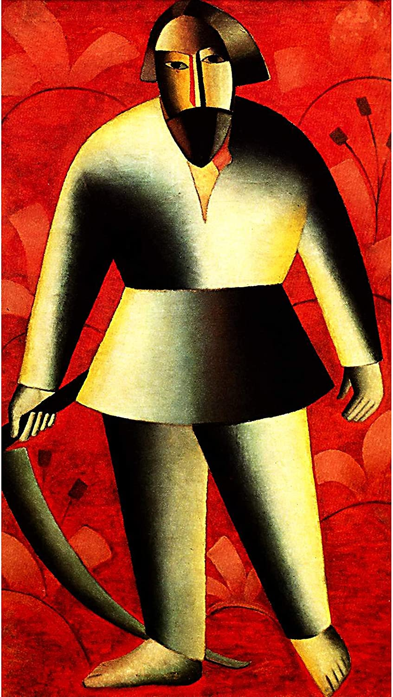

## 基本信息

- 作者：[[马列维奇 Kazimir Malevich]]
- 创作年代：1913
- 材质：布面油画 (*not from wiki*)
- 尺寸：年代不详 (*not from wiki*)
- 现存地：俄罗斯下诺夫哥罗德国立艺术博物馆 (*not from wiki*)

## 画面与技法

与 [[伐木者 (马列维奇) The Woodcutter]] 同属 [[马列维奇 Kazimir Malevich]] 1912–1913 年的**俄罗斯—立体主义**阶段——圆柱体几何分解 + 俄罗斯农民风俗题材。

## 图片清单

| 编号 | 出自 | 描述 |
|---|---|---|
| 01 | [[083｜马列维奇：什么是至上主义？]] | 全画 |

## 出现在

- [[083｜马列维奇：什么是至上主义？]]
