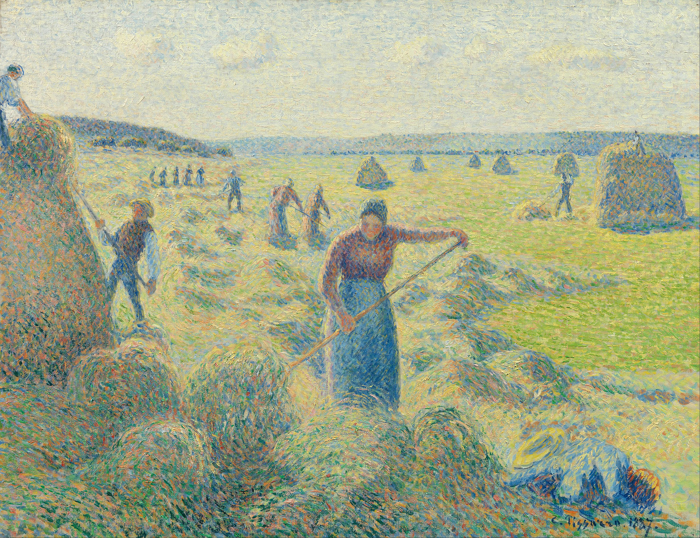

## 基本信息

- **作者**：[[毕沙罗 Camille Pissarro]]
- **创作年代**：1887
- **材质**：(*not from wiki*) 布面油画
- **尺寸**：(*not from wiki*) 54 × 65 cm
- **现存地**：(*not from wiki*) 阿姆斯特丹梵高博物馆 (Van Gogh Museum)

## 画面与技法

毕沙罗**跟风修拉的[[点彩 Pointillism]]时期**代表作。顾衡 047 用此画作证："**修拉的这个科学绘画，把毕沙罗也给带沟里去了，他也跟着点点点，画了好几年点彩。**" 044 也提示过这一阶段——毕沙罗"后来被修拉拐到沟里去过"。

技术上是 [[新印象主义 Neo-Impressionism]] / [[分色主义 Divisionism]] 路线的实践：小圆点 + 视觉混和。但与修拉的极端工程纪律相比，毕沙罗的"点法"更温和、保留了他本人"轻抹淡扫" + "色调过渡"的本能（参 044 风格描述）。

## 历史背景 *(not from wiki)*

- 1884 年毕沙罗在第八届印象派画展中接触修拉与 [[西涅克 Paul Signac]]，开始转向新印象主义
- 1886–1889 是毕沙罗的"点彩期"，《收干草》是这一阶段的代表
- 1890 前后毕沙罗放弃点彩，回到自己的笔触习惯——理由（*not from wiki*）大致是：操作慢 / 画面僵硬 / 不适合他乡村风景的题材习惯

## 与毕沙罗其他作品的对比

参 [[毕沙罗 Camille Pissarro]] 页：毕沙罗本来的笔触是"**轻抹淡扫**"，调色温和，调色温和；点彩期是他**短期的方法论实验**，与他长期风格构成反差。

## 图片清单

| 编号 | 出自 | 描述 |
|---|---|---|
| 01 | [[047｜修拉：新印象主义为什么走进了死胡同？]] | 整幅画作 |

## 出现在

- [[047｜修拉：新印象主义为什么走进了死胡同？]] —— 修拉影响毕沙罗的样本
- [[044｜莫利索和毕沙罗：最纯正的印象派什么样？]] —— 044 已铺垫"毕沙罗后来被修拉拐到沟里"
