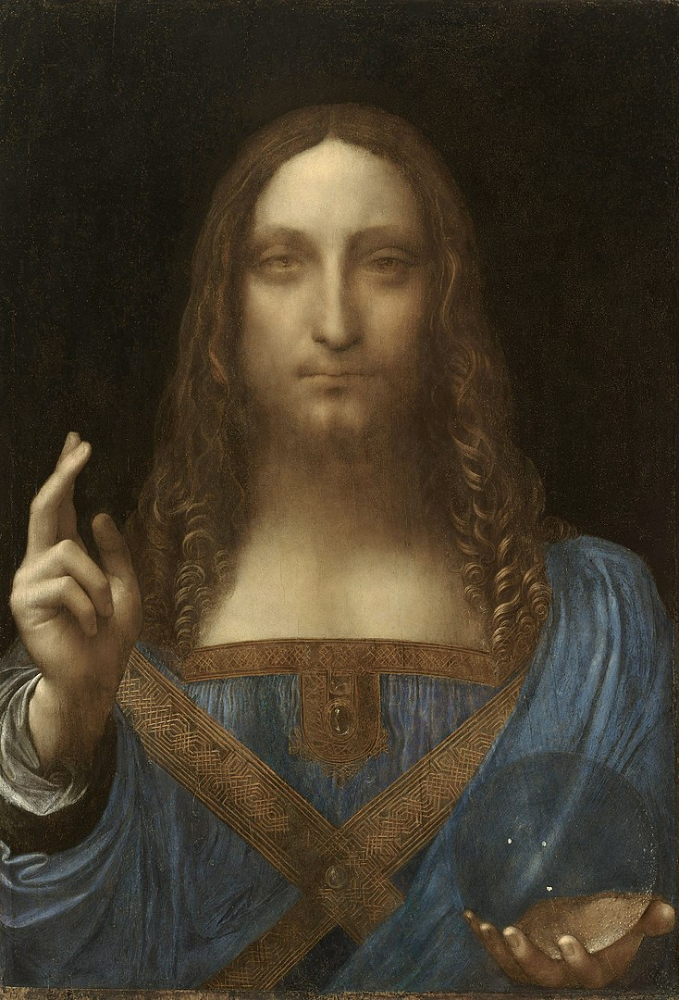

## 基本信息

- 作者：[[达·芬奇 Leonardo da Vinci]]（归属仍有争议） (*not from wiki*)
- 创作年代：约 1499–1510
- 材质：木板油画 (*not from wiki*)
- 尺寸：约 65 × 45 cm (*not from wiki*)
- 现存地：(*未公开展出；2017 年拍卖后由沙特阿拉伯王储购得*) (*not from wiki*)

## 画面与技法

基督正面立像，**右手作祝福手势**，**左手握水晶球**（救世主的传统图像志符号）。带 [[达·芬奇 Leonardo da Vinci]] 的标志性 [[晕涂法 Sfumato]]——面部柔和无线条，眼神朦胧。

顾衡 078 仅作为对照物提及：截至 2021 年，**绘画作品拍卖价第一名**——**4.5 亿美元**（2017 年纽约佳士得）。

## 历史背景 (*not from wiki*)

归属争议持续——部分学者认为是达·芬奇真迹、部分认为是工坊作品。2017 年 11 月以 4.5 亿美元成交（含佣金），创历史最高拍卖纪录；买家被披露为沙特王储 Mohammed bin Salman。此后该画从未公开展出。

## 图片清单

| 编号 | 出自 | 描述 |
|---|---|---|
| 01 | [[078｜莫迪里阿尼：画中女子为什么让人一眼难忘？]] | 正面持球祝福像 |

## 出现在

- [[078｜莫迪里阿尼：画中女子为什么让人一眼难忘？]]（作为拍卖价对照——本课主角 [[侧卧的裸女 (莫迪里阿尼) Reclining Nude]] 排第三）
