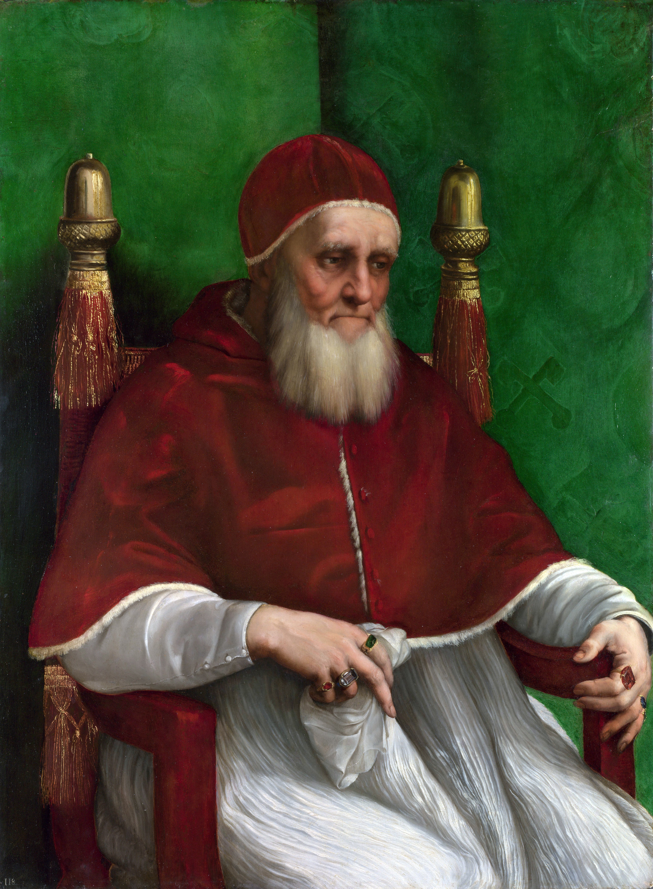

## 基本信息

- 作者：[[拉斐尔 Raphael]]
- 创作年代：1511–1512 (顾衡引"1511") (*not from wiki*)
- 材质：白杨木板油彩
- 尺寸：108.7 × 81 cm (*not from wiki*)
- 现存地：伦敦国家美术馆 (The National Gallery, London) (*not from wiki*)

## 画面与技法

四分之三胸像。教皇尤利乌斯二世 (1443–1513, 在位 1503–1513) 坐着，身着红色 mozzetta + 白色 rochet，头戴白色 camauro，胡须**蓄得不规整**——他刚战胜法国军队后回到罗马、为示哀痛与忏悔留须。手指紧握椅子扶手与一块手帕。

**革命性的肖像构图**——拉斐尔放弃了之前教皇肖像那种正面 / 庄严的程式，**把教皇画成"沉思中的老人"**——把权力人物画成**有内心活动的私人**。这一构图被后世几百年的国王 / 教皇 / 政治人物肖像反复借用 (委拉斯凯兹 *Pope Innocent X* 直接是它的回响)。

## 历史背景

(*not from wiki*) 教皇尤利乌斯二世 1443 年出生于罗维雷家族，给自己起名 *Julius*（凯撒名），野心是成为另一个凯撒——发起重建罗马的大工程，召拉斐尔来绘梵蒂冈宫壁画 (1508 起)、米开朗基罗绘西斯廷天顶画 (1508–1512)、布拉曼特设计新圣彼得大教堂。**他是文艺复兴最重要的赞助教皇**。

顾衡 011 把他作为"拉斐尔和甲方关系的关键人物"——尤利乌斯二世 1508 起把整个签字大厅交给拉斐尔，甚至让原画家全部撤离、原有壁画被刮掉。**拉斐尔由此从佛罗伦萨地方画家跃升为罗马顶级艺术家**。

## 图片清单

| 编号 | 出自 | 描述 |
|---|---|---|
| 01 | [[011｜拉斐尔：为什么说他是"集大成者"？]] | 整体图 |
| 02 | [[020｜丢勒：为什么版画那么重要？]] | 整体图（作为"侧脸默认"对照——连教皇国王都画侧脸） |

## 出现在

- [[011｜拉斐尔：为什么说他是"集大成者"？]]
- [[020｜丢勒：为什么版画那么重要？]]（"侧脸默认"对照）
