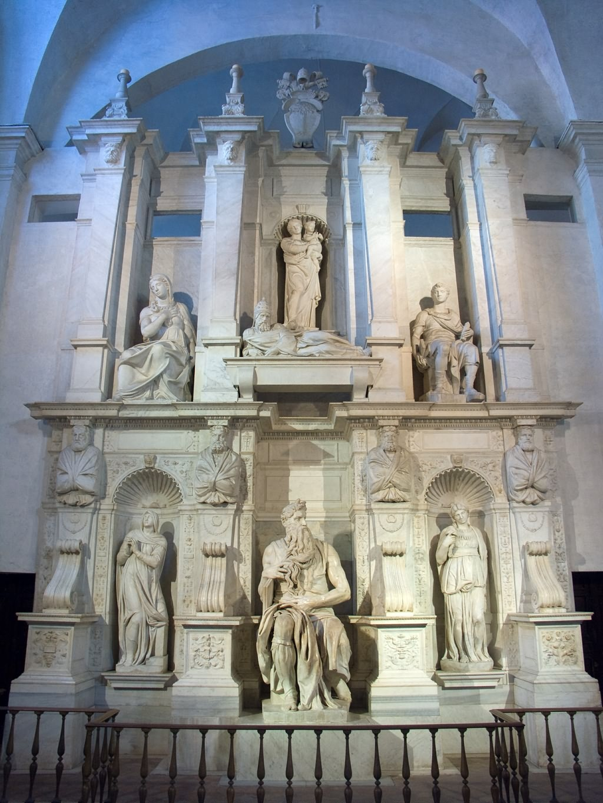

## 基本信息

- 作者：[[米开朗基罗 Michelangelo]]
- 创作年代：1505–1545 (40 年) (*not from wiki*)
- 材质：大理石建筑 + 雕塑组群
- 尺寸：(*not from wiki*) 数米高，最终版含 7 尊雕塑
- 现存地：罗马圣彼得镣铐教堂 (San Pietro in Vincoli, Roma)——这是缩水多次后的最终版本，与原设计相去甚远

## 画面与技法

**原设计**：1505 年米开朗基罗与教皇尤利乌斯二世共同构思，**三层 40+ 雕塑**：

- **最下层**：约 20 个**奴隶**——喻意不知悔改的人类灵魂遭到束缚
- **中间层**：圣徒群像
- **最上层**：两个天使一左一右**拉着教皇直升天堂**

**实际落地**：教皇 1513 去世后历任教皇不断**给米开朗基罗加塞新任务**（西斯廷天顶画 / 美第奇礼拜堂 / 末日审判），陵寝项目被**三次大中断**——耗时 40 年，米开朗基罗 70 岁那年才**勉强交付一个极度缩水的版本**。原计划的奴隶雕像散落各处（卢浮宫的 *Dying Slave* / *Rebellious Slave* + 佛罗伦萨的 *Prisoners* 系列）。

**保留下来的核心**：中央的 **摩西** 雕像 (Moses, 1513–1515) —— 长须、坐姿、手持十诫石板，被认为是米开朗基罗雕塑最高水平之一 (*not from wiki*)。米开朗基罗据传曾用锤子敲摩西的膝盖喝道："为什么你不说话？"——因为雕得太真，他自己也以为它该开口了。

## 历史背景

(*not from wiki*) 这是米开朗基罗一生的"未竟工程"。三次大中断分别是：

1. 1508–1512 **西斯廷天顶画** （[[西斯廷天顶画 Sistine Chapel Ceiling]]）
2. 1519–1534 **美第奇礼拜堂** （[[美第奇礼拜堂雕塑 Medici Chapel Sculptures]]）
3. 1536–1541 **末日审判** （[[末日审判 The Last Judgment]]）

这三次"打断"反而串起了米开朗基罗最伟大的作品。

## 图片清单

| 编号 | 出自 | 描述 |
|---|---|---|
| 01 | [[012｜米开朗基罗：他为什么能被艺术史家"封神"？]] | 最终版整体图（圣彼得镣铐教堂） |

## 出现在

- [[012｜米开朗基罗：他为什么能被艺术史家"封神"？]]
