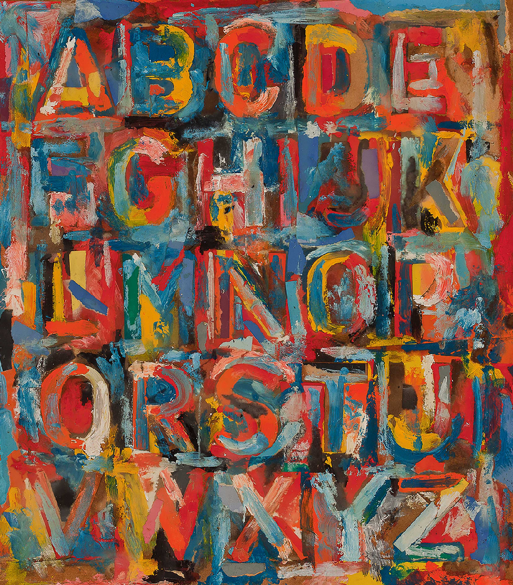

## 基本信息

- 作者：[[贾斯珀·琼斯 Jasper Johns]]
- 创作年代：1959
- 材质：（*not from wiki*）布面油画 / 综合材料
- 尺寸：（*not from wiki*）信息不全
- 现存地：（*not from wiki*）信息不全

## 画面与技法

把现成的**数字和字母表**作为画面主体——既不是抽象表现主义的笔触，也不是波普艺术的明星脸，而是**人人识得、看似最不可能成为"艺术"的符号**。顾衡 098 引此作为例：

> [[贾斯珀·琼斯 Jasper Johns]] 和 [[劳申伯格 Robert Rauschenberg]] 走的还是 [[杜尚 Marcel Duchamp]] 的反艺术道路，也就是说，他们挖空心思追求的，是做一件小便池那样的、很难被承认为艺术的东西。

也就是说，琼斯在这里玩的不是"流行文化能否进艺术"，而是"非美感符号能否被认作艺术"——是 [[泉 (杜尚) Fountain (Duchamp)]] 路线的延续。

## 历史背景 (*not from wiki*)

- 琼斯在 1950 年代末画了一系列以旗帜、靶子、数字、字母为主体的作品；这些题材的共同点是"图案本身既不构成抽象也不构成具象"——逼迫观众重新判断"什么是艺术"。

## 图片清单

| 编号 | 出自 | 描述 |
|---|---|---|
| 01 | [[098｜波普艺术：流行文化如何成为艺术？]] | 作品全图 |

## 出现在

- [[098｜波普艺术：流行文化如何成为艺术？]]
